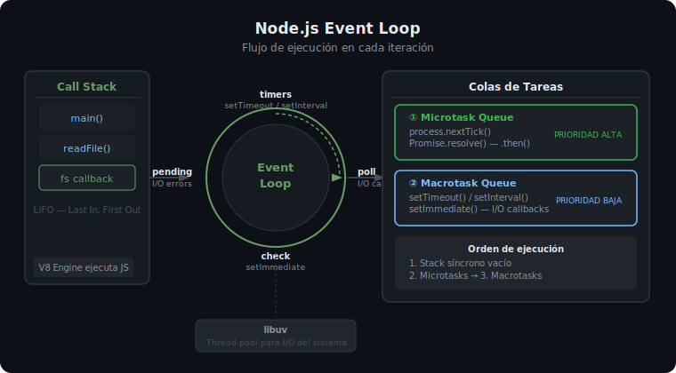

# El Runtime de Node.js

## 🎯 Objetivos

Al finalizar este archivo, comprenderás:

- Qué es Node.js y cómo difiere del entorno del navegador
- Cómo funciona el Event Loop y por qué Node.js es rápido para I/O
- Qué significa "no bloqueante" y por qué importa en APIs REST
- Cómo acceder al objeto `process` para interactuar con el entorno

## 📋 ¿Qué es Node.js?

Node.js es un **runtime de JavaScript** construido sobre el motor V8 de Chrome. Permite ejecutar JavaScript fuera del navegador, en el servidor.

> 💡 **Diferencia con el frontend**: En el navegador, JavaScript interactúa con el DOM. En Node.js, no hay DOM — en cambio, tienes acceso al sistema de archivos, red, procesos del sistema y más.

```ts
// En el navegador:          | En Node.js:
// document.getElementById() | fs.readFile()
// window.location           | process.env
// localStorage              | path.join()
// fetch()                   | net.createServer()
```

## 📋 El Modelo de I/O No Bloqueante

Node.js usa un **único hilo** (single thread) para ejecutar JavaScript, pero puede manejar miles de operaciones simultáneas gracias a su modelo asíncrono.

### El problema del I/O bloqueante

```ts
// ❌ BLOQUEANTE — el proceso se detiene hasta que la DB responde
// (No se puede hacer esto en Node.js de forma eficiente)
const user = database.findUserSync(1);   // espera 200ms
const posts = database.findPostsSync(1); // espera 200ms más
// Total: 400ms, el hilo está bloqueado todo ese tiempo
```

```ts
// ✅ NO BLOQUEANTE — Node.js delega la espera y sigue procesando
// mientras la DB responde, el hilo atiende otras solicitudes
const [user, posts] = await Promise.all([
  database.findUser(1),   // delega la espera
  database.findPosts(1),  // delega la espera
]);
// Total: ~200ms, el hilo nunca estuvo bloqueado
```

## 📋 El Event Loop

El Event Loop es el mecanismo central que permite a Node.js ejecutar operaciones asíncronas sin bloquear el hilo.



```
┌─────────────────────────────────────────┐
│              Código JavaScript           │
│           (Call Stack — un hilo)        │
└───────────────────┬─────────────────────┘
                    │ delega I/O
         ┌──────────▼──────────┐
         │   Libuv (C++)        │
         │  Thread Pool (I/O)   │
         │  OS async I/O        │
         └──────────┬──────────┘
                    │ callback listo
         ┌──────────▼──────────┐
         │    Event Queue       │
         │  (cola de callbacks) │
         └──────────┬──────────┘
                    │ cuando el Call Stack está vacío
         ┌──────────▼──────────┐
         │    Event Loop        │
         │  (mueve callbacks    │
         │   al Call Stack)     │
         └─────────────────────┘
```

### Fases del Event Loop (orden de ejecución)

```ts
// Orden de prioridad en un tick del Event Loop:

process.nextTick(() => console.log('1 — nextTick (mayor prioridad)'));

Promise.resolve().then(() => console.log('2 — microtask (Promise)'));

setImmediate(() => console.log('3 — setImmediate'));

setTimeout(() => console.log('4 — setTimeout'), 0);

console.log('0 — síncrono (se ejecuta primero)');

// Output:
// 0 — síncrono
// 1 — nextTick
// 2 — microtask
// 3 — setImmediate
// 4 — setTimeout
```

> ⚠️ **Importante**: Nunca bloquees el Event Loop con operaciones síncronas pesadas (loops infinitos, JSON.parse de archivos enormes). Eso congela **todo** el servidor.

## 📋 El Objeto `process`

```ts
// Información del entorno de ejecución
console.log(process.version);      // 'v22.0.0'
console.log(process.platform);     // 'linux', 'darwin', 'win32'
console.log(process.pid);          // ID del proceso
console.log(process.cwd());        // Directorio de trabajo actual

// Variables de entorno (NUNCA hardcodear secretos en código)
const dbUrl = process.env.DATABASE_URL;
const port = parseInt(process.env.PORT ?? '3000', 10);

// Argumentos CLI
// node dist/index.js --env=production
const args = process.argv.slice(2); // ['--env=production']

// Terminar el proceso
process.exit(0);  // 0 = éxito, 1 = error
```

## ⚠️ Errores Comunes

- **Bloquear el Event Loop**: usar `fs.readFileSync()` en un endpoint de Express — bloquea todas las peticiones mientras lee el archivo
- **No manejar rejections**: una Promise rechazada sin `.catch()` o `try/catch` puede crashear el proceso en Node.js 22
- **Confundir `process.cwd()` con `__dirname`**: `cwd()` es donde está el terminal, `__dirname` (CommonJS) / `import.meta.dirname` (ESM) es donde está el archivo

```ts
// ✅ Siempre manejar errores en async
process.on('unhandledRejection', (reason) => {
  console.error('Unhandled rejection:', reason);
  process.exit(1);
});
```

## 📚 Recursos Adicionales

- [Node.js — About Node.js](https://nodejs.org/en/about)
- [Node.js — The Node.js Event Loop](https://nodejs.org/en/docs/guides/event-loop-timers-and-nexttick)
- [Node.js — process object](https://nodejs.org/docs/latest/api/process.html)

## ✅ Checklist de Verificación

Antes de continuar a las prácticas, verifica que entiendes:

- [ ] Por qué Node.js puede manejar miles de conexiones con un solo hilo
- [ ] Qué ocurre en el Event Loop cuando se hace una consulta a la DB
- [ ] El orden de ejecución: síncrono → nextTick → microtasks → setTimeout/setImmediate
- [ ] Para qué sirve `process.env` y por qué no hardcodear secretos
