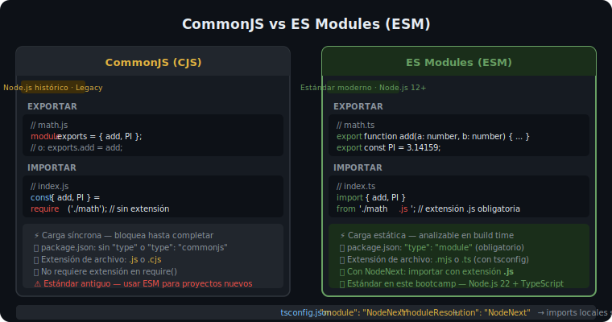

# Módulos ES Modules (ESM) en Node.js

## 🎯 Objetivos

Al finalizar este archivo, comprenderás:

- La diferencia entre CommonJS (`require`) y ES Modules (`import`)
- Cómo configurar Node.js para usar ESM con TypeScript
- Exportar e importar: named exports, default exports y re-exports
- Trabajar con rutas de archivo en ESM con `import.meta.url`
- Usar los módulos built-in de Node.js más comunes: `fs`, `path`, `url`

## 📋 CommonJS vs ES Modules



Node.js tuvo históricamente dos sistemas de módulos:

```ts
// CommonJS (legacy) — .js o .cjs
const express = require('express');
const { join } = require('path');
module.exports = { myFunction };

// ES Modules (moderno) — .js con "type": "module" o .mjs
import express from 'express';
import { join } from 'path';
export { myFunction };
```

> 💡 **En este bootcamp usamos siempre ESM**. Configuramos `"type": "module"` en `package.json` y `"module": "NodeNext"` en `tsconfig.json`.

## 📋 Tipos de Exportación

```ts
// ============================================
// named exports — la forma más común en backend
// ============================================

// user.service.ts
export async function findUserById(id: string): Promise<User | null> {
  return prisma.user.findUnique({ where: { id } });
}

export async function createUser(dto: CreateUserDto): Promise<User> {
  return prisma.user.create({ data: dto });
}

// user.controller.ts — importar solo lo necesario
import { findUserById, createUser } from './user.service.js';
// ⚠️ Nota: con NodeNext, los imports locales DEBEN incluir .js


// ============================================
// default export — para clases o instancias únicas
// ============================================

// logger.ts
import winston from 'winston';
const logger = winston.createLogger({ /* config */ });
export default logger;

// app.ts
import logger from './logger.js';
logger.info('Server started');


// ============================================
// re-exports — barril (index.ts)
// ============================================

// routes/index.ts
export { userRouter } from './user.routes.js';
export { authRouter } from './auth.routes.js';
export { itemRouter } from './item.routes.js';

// app.ts — importar todo de un solo lugar
import { userRouter, authRouter, itemRouter } from './routes/index.js';
```

## 📋 Rutas de Archivos en ESM

En CommonJS existía `__dirname`. En ESM se reemplaza con `import.meta.url`:

```ts
import { fileURLToPath } from 'url';
import { dirname, join, resolve } from 'path';

// Equivalente a __dirname en CommonJS
const __filename = fileURLToPath(import.meta.url);
const __dirname = dirname(__filename);

// En Node.js 22+ existe import.meta.dirname directamente
const currentDir = import.meta.dirname; // más limpio

// Construir rutas absolutas robustas
const dataPath = join(currentDir, '..', 'data', 'records.json');
const configPath = resolve(currentDir, 'config.json');
```

## 📋 Módulos Built-in Más Usados

### `fs/promises` — sistema de archivos

```ts
import { readFile, writeFile, mkdir } from 'fs/promises';
import { existsSync } from 'fs'; // la versión síncrona (usar con moderación)

// Leer un archivo y parsear JSON
async function loadConfig(): Promise<AppConfig> {
  // readFile retorna un Buffer; toString() o 'utf-8' lo convierte a string
  const raw = await readFile('config.json', 'utf-8');
  return JSON.parse(raw) as AppConfig;
}

// Escribir un archivo (crea o sobreescribe)
async function saveData(data: unknown): Promise<void> {
  const json = JSON.stringify(data, null, 2);
  await writeFile('output.json', json, 'utf-8');
}
```

### `path` — manipulación de rutas

```ts
import { join, resolve, extname, basename, dirname } from 'path';

join('/users', 'john', 'uploads');     // '/users/john/uploads' (multiplataforma)
resolve('src', 'index.ts');            // ruta absoluta desde cwd
extname('photo.jpg');                  // '.jpg'
basename('/routes/user.routes.ts');    // 'user.routes.ts'
dirname('/routes/user.routes.ts');     // '/routes'
```

### `url` — trabajo con URLs y `import.meta`

```ts
import { fileURLToPath, pathToFileURL } from 'url';

const filePath = fileURLToPath('file:///home/user/app/index.js');
// '/home/user/app/index.js'

const fileUrl = pathToFileURL('/home/user/app/index.js').href;
// 'file:///home/user/app/index.js'
```

## ⚠️ Errores Comunes

- **Olvidar `.js` en imports locales con NodeNext**: `import { fn } from './utils'` → error; debe ser `'./utils.js'`
- **Mezclar CommonJS y ESM**: un archivo `.cjs` no puede `import` un archivo `.mjs` directamente sin adaptadores
- **`require is not defined`**: ocurre cuando se usa `require()` en un módulo ESM — usar siempre `import`
- **`import.meta.url` en archivos no-ESM**: solo funciona en módulos ES; en CommonJS usa `__dirname`

## 📚 Recursos Adicionales

- [Node.js — ES Modules](https://nodejs.org/docs/latest/api/esm.html)
- [Node.js — Path](https://nodejs.org/docs/latest/api/path.html)
- [Node.js — fs/promises](https://nodejs.org/docs/latest/api/fs.html#promises-api)

## ✅ Checklist de Verificación

Antes de continuar, verifica que puedes:

- [ ] Crear un archivo `.ts` con named exports y otro que los importe (con `.js` al final)
- [ ] Usar `import.meta.dirname` para construir una ruta absoluta a un archivo
- [ ] Leer un archivo JSON con `fs/promises` y tiparlo con TypeScript
- [ ] Explicar cuándo usar `default export` vs `named export`
