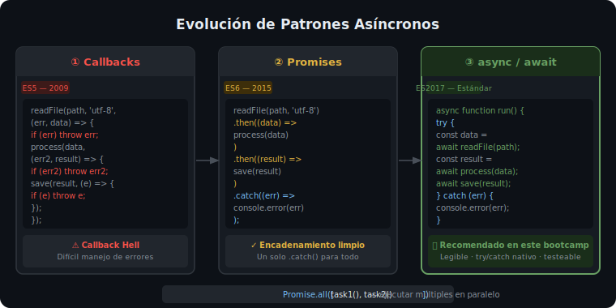

# Asincronía en Node.js: async/await

## 🎯 Objetivos

Al finalizar este archivo, comprenderás:

- La evolución del código asíncrono: callbacks → Promises → async/await
- Cómo escribir funciones asíncronas tipadas con TypeScript
- Manejar errores correctamente con `try`/`catch`
- Ejecutar operaciones en paralelo con `Promise.all` y `Promise.allSettled`
- Cuándo usar `Promise.all` vs operaciones secuenciales

## 📋 La Evolución del Código Asíncrono



### 1. Callbacks (el pasado — evitar)

```ts
import { readFile } from 'fs';

// ❌ Callback hell — difícil de leer y mantener
readFile('users.json', 'utf-8', (err, data) => {
  if (err) {
    console.error('Error reading users:', err);
    return;
  }
  const users = JSON.parse(data);
  readFile('posts.json', 'utf-8', (err2, data2) => {
    if (err2) {
      console.error('Error reading posts:', err2);
      return;
    }
    // ... más callbacks anidados
  });
});
```

### 2. Promises (intermedio)

```ts
import { readFile } from 'fs/promises';

// ✅ Mejor, pero encadenar .then() se complica con lógica compleja
readFile('users.json', 'utf-8')
  .then((data) => JSON.parse(data))
  .then((users) => console.log('Users:', users))
  .catch((err) => console.error('Error:', err));
```

### 3. async/await (moderno — usar siempre)

```ts
import { readFile } from 'fs/promises';

// ✅ Código asíncrono que parece síncrono — fácil de leer
async function loadUsers(): Promise<User[]> {
  // try/catch captura tanto errores de I/O como de lógica
  try {
    const raw = await readFile('users.json', 'utf-8');
    return JSON.parse(raw) as User[];
  } catch (error) {
    // En Node.js, los errores de fs tienen un código:
    if ((error as NodeJS.ErrnoException).code === 'ENOENT') {
      throw new Error('File users.json not found');
    }
    throw error; // re-lanzar errores inesperados
  }
}
```

## 📋 Tipado Correcto de Funciones Async

```ts
// El tipo de retorno de una función async es siempre Promise<T>
async function findUser(id: string): Promise<User | null> {
  return prisma.user.findUnique({ where: { id } });
}

// Cuando no retorna nada: Promise<void>
async function sendEmail(to: string, subject: string): Promise<void> {
  await emailService.send({ to, subject });
  // No hay return explícito — retorna Promise<void>
}

// Error tipado — nunca capturar como `any`
async function parseJson<T>(raw: string): Promise<T> {
  try {
    return JSON.parse(raw) as T;
  } catch (error) {
    // error tiene tipo `unknown` con strict: true
    const message = error instanceof Error ? error.message : 'Parse error';
    throw new Error(`Invalid JSON: ${message}`);
  }
}
```

## 📋 Operaciones Paralelas vs Secuenciales

```ts
// ❌ Secuencial innecesario — total ~400ms
async function getUserData(userId: string): Promise<UserData> {
  const user = await prisma.user.findUnique({ where: { id: userId } });   // 200ms
  const posts = await prisma.post.findMany({ where: { authorId: userId } }); // 200ms
  return { user, posts };
}

// ✅ Paralelo — total ~200ms (ambas consultas corren al mismo tiempo)
async function getUserData(userId: string): Promise<UserData> {
  const [user, posts] = await Promise.all([
    prisma.user.findUnique({ where: { id: userId } }),
    prisma.post.findMany({ where: { authorId: userId } }),
  ]);
  return { user, posts };
}
```

### Promise.all vs Promise.allSettled

```ts
// Promise.all — falla rápido: si UNA promesa falla, todas fallan
try {
  const [users, products] = await Promise.all([
    fetchUsers(),     // si esto falla...
    fetchProducts(),  // ...esta también se cancela
  ]);
} catch (error) {
  // catch recibe el primer error que ocurrió
}

// Promise.allSettled — espera TODAS, sin importar si fallan
const results = await Promise.allSettled([
  fetchUsers(),
  fetchProducts(),
]);

results.forEach((result) => {
  if (result.status === 'fulfilled') {
    console.log('Success:', result.value);
  } else {
    console.error('Failed:', result.reason);
  }
});
// Útil cuando quieres procesar cada resultado independientemente
```

## 📋 Manejo de Errores en APIs REST

```ts
// Patrón estándar para controladores Express con async/await
export async function getUser(req: Request, res: Response, next: NextFunction): Promise<void> {
  try {
    const user = await userService.findById(req.params.id);

    if (!user) {
      // 404 — el recurso no existe
      res.status(404).json({ message: 'User not found' });
      return; // importante: detener ejecución después de responder
    }

    res.json(user); // 200 OK implícito
  } catch (error) {
    // Delegar al middleware global de errores
    next(error);
  }
}
```

## ⚠️ Errores Comunes

- **`await` fuera de función `async`**: error de sintaxis — el `await` solo funciona dentro de funciones marcadas como `async`
- **No hacer `return` después de `res.json()`**: Express puede intentar enviar una segunda respuesta → `Cannot set headers after they are sent`
- **Capturar `error` como `any`**: con `strict: true`, usa `instanceof Error` o type narrowing para evitar usar `error.message` directamente
- **`Promise.all` con muchas queries**: puede generar demasiadas conexiones simultáneas a la DB — usar con criterio

## 📚 Recursos Adicionales

- [MDN — async function](https://developer.mozilla.org/en-US/docs/Web/JavaScript/Reference/Statements/async_function)
- [Node.js — Error handling](https://nodejs.org/en/docs/guides/error-handling)
- [MDN — Promise.all](https://developer.mozilla.org/en-US/docs/Web/JavaScript/Reference/Global_Objects/Promise/all)

## ✅ Checklist de Verificación

Antes de continuar, verifica que puedes:

- [ ] Convertir una función con callbacks a async/await
- [ ] Tipar correctamente el retorno de una función async con TypeScript
- [ ] Manejar errores en async/await con `try/catch` sin perder el tipo del error
- [ ] Elegir correctamente entre `Promise.all` y operaciones secuenciales
- [ ] Aplicar el patrón `try/catch/next` en un controlador Express
