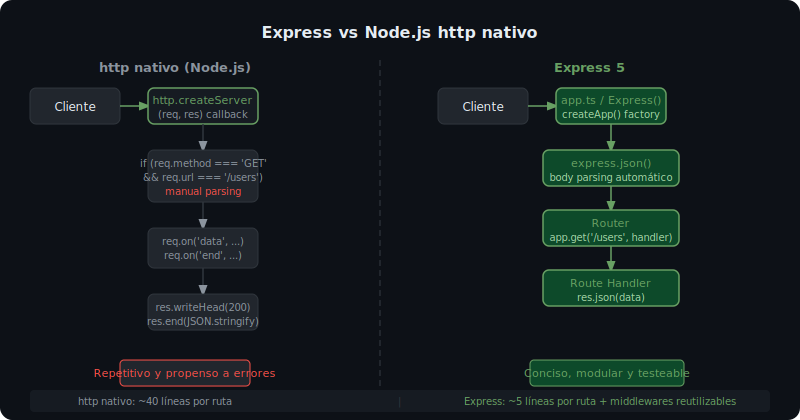

# HTTP y Express 5: Servidor Básico

## 🎯 Objetivos

Al finalizar este archivo, comprenderás:

- Qué problema resuelve Express sobre el módulo `http` nativo de Node.js
- Cómo crear y configurar un servidor Express 5 con TypeScript
- La diferencia entre `app.ts` (configuración) y `server.ts` (arranque)
- Cómo usar variables de entorno para el puerto con `process.env`



## 📋 ¿Qué es Express?

Express es un framework minimalista para Node.js que simplifica la creación de servidores HTTP. Añade sobre el módulo `http` nativo: routing declarativo, middleware chaineable y una API limpia para `req`/`res`.

```ts
// ❌ Sin Express — HTTP nativo (verboso)
import { createServer, IncomingMessage, ServerResponse } from 'http';

createServer((req: IncomingMessage, res: ServerResponse) => {
  if (req.method === 'GET' && req.url === '/users') {
    res.writeHead(200, { 'Content-Type': 'application/json' });
    res.end(JSON.stringify({ users: [] }));
  } else if (req.method === 'POST' && req.url === '/users') {
    // ...parsear body manualmente con eventos 'data' y 'end'
  } else {
    res.writeHead(404);
    res.end();
  }
}).listen(3000);

// ✅ Con Express — limpio y expresivo
import express from 'express';
const app = express();
app.use(express.json());

app.get('/users', (_req, res) => res.json({ users: [] }));
app.post('/users', (req, res) => res.status(201).json(req.body));

app.listen(3000);
```

## 📋 Separar app.ts y server.ts

La arquitectura estándar separa la **configuración** del **arranque**:

```ts
// src/app.ts — Configura Express (importable en tests)
import express, { Application } from 'express';

export function createApp(): Application {
  const app = express();

  // Middlewares globales
  app.use(express.json());
  app.use(express.urlencoded({ extended: true }));

  // Rutas
  app.get('/health', (_req, res) => {
    res.json({ status: 'ok', timestamp: new Date().toISOString() });
  });

  return app;
}
```

```ts
// src/server.ts — Arranca el servidor (entry point)
import { createApp } from './app.js';

const PORT = Number(process.env.PORT) || 3000;
const app = createApp();

const server = app.listen(PORT, () => {
  console.log(`Server running on http://localhost:${PORT}`);
});

// Graceful shutdown: cerrar conexiones al recibir SIGTERM
process.on('SIGTERM', () => {
  server.close(() => {
    console.log('Server closed');
    process.exit(0);
  });
});
```

> 💡 **¿Por qué separar?** Los tests de integración importan `app.ts` sin arrancar el servidor real. `server.ts` solo se ejecuta en producción/desarrollo.

## 📋 Instalación de Express 5 con TypeScript

```bash
# Instalar Express 5 (producción) y tipos (desarrollo)
pnpm add express@5.1.0
pnpm add -D @types/express@5.0.1 @types/node@22.15.21 tsx@4.19.4 typescript@5.8.3
```

```json
// package.json
{
  "type": "module",
  "scripts": {
    "dev": "tsx watch src/server.ts",
    "build": "tsc --noEmit",
    "start": "node dist/src/server.js"
  }
}
```

## 📋 Variables de Entorno

Nunca hardcodear puertos ni configuración. Usar `process.env`:

```ts
// src/config/env.ts
const PORT = Number(process.env.PORT) || 3000;
const NODE_ENV = process.env.NODE_ENV ?? 'development';

export const config = { PORT, NODE_ENV };
```

```bash
# .env (gitignored)
PORT=3000
NODE_ENV=development
```

> ⚠️ **Nunca subas `.env` a git.** Usa `.env.example` con valores de ejemplo sin secretos reales.

## 📋 Cambios en Express 5 vs Express 4

Express 5 (lanzado en 2024) llega con mejoras importantes:

```ts
// Express 5: los handlers async no necesitan try/catch — los errores se propagan a next()
app.get('/users/:id', async (req, res) => {
  // Si loadUser lanza, Express 5 llama automáticamente a next(error)
  const user = await userService.loadUser(req.params.id);
  res.json(user);
});

// Express 4: necesitabas envolver todo en try/catch o usar express-async-errors
app.get('/users/:id', async (req, res, next) => {
  try {
    const user = await userService.loadUser(req.params.id);
    res.json(user);
  } catch (err) {
    next(err); // obligatorio en Express 4
  }
});
```

## 📚 Recursos Adicionales

- [Express 5 — Getting started](https://expressjs.com/en/5x/api.html)
- [Migrating to Express 5](https://expressjs.com/en/guide/migrating-5.html)

## ✅ Checklist de Verificación

- [ ] `pnpm dev` arranca el servidor sin errores
- [ ] `GET /health` retorna `{ status: 'ok' }`
- [ ] `app.ts` y `server.ts` están separados
- [ ] El puerto viene de `process.env.PORT`
- [ ] TypeScript compila sin errores (`pnpm build`)
