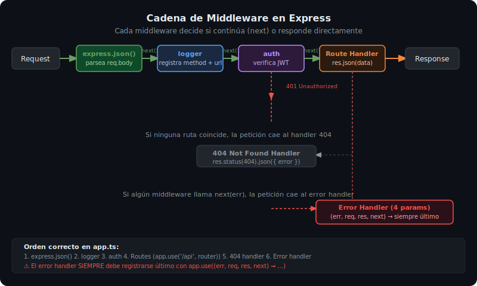

# Middleware en Express

## 🎯 Objetivos

Al finalizar este archivo, comprenderás:

- Qué es un middleware y cuál es su firma de función
- Cómo funciona la cadena de middlewares y el rol de `next()`
- Los tipos principales: globales, de ruta, de error
- Cómo escribir middlewares propios reutilizables

## 📋 ¿Qué es un Middleware?

Un middleware es una función con acceso a `req`, `res` y `next`. Se ejecuta en orden, formando una **cadena (pipeline)**. Cada middleware decide si pasa el control al siguiente (`next()`) o termina la respuesta.

```ts
import { Request, Response, NextFunction } from 'express';

// Firma de un middleware estándar
function myMiddleware(req: Request, res: Response, next: NextFunction): void {
  // Hacer algo con req o res
  console.log(`${req.method} ${req.path}`);

  // Pasar al siguiente middleware o handler de ruta
  next();

  // ⚠️ NO llamar next() y res.json() en el mismo middleware
}
```

## 📋 La Cadena de Middlewares



El orden en que se registran los middlewares con `app.use()` **es el orden de ejecución**:

```ts
// src/app.ts
import express from 'express';
import morgan from 'morgan';

const app = express();

// 1️⃣ Middlewares globales (se ejecutan en TODAS las rutas)
app.use(express.json());           // parsear body JSON
app.use(morgan('dev'));            // logging de peticiones

// 2️⃣ Middleware de autenticación (en rutas protegidas)
app.use('/api/v1/admin', authMiddleware);

// 3️⃣ Rutas
app.use('/api/v1/products', productsRouter);
app.use('/api/v1/users', usersRouter);

// 4️⃣ Middleware 404 — si ninguna ruta coincidió
app.use((_req, res) => {
  res.status(404).json({ error: 'Route not found' });
});

// 5️⃣ Middleware de errores — SIEMPRE al final, SIEMPRE 4 parámetros
app.use(errorHandler);
```

## 📋 Tipos de Middlewares

### Global (aplica a todas las rutas)

```ts
// Logger personalizado
function requestLogger(req: Request, _res: Response, next: NextFunction): void {
  const start = Date.now();
  console.log(`→ ${req.method} ${req.path}`);
  // next() delega al siguiente middleware
  next();
}

app.use(requestLogger);
```

### De ruta (aplica solo a rutas específicas)

```ts
// Solo se ejecuta en peticiones a /api/v1/admin/*
function authMiddleware(req: Request, res: Response, next: NextFunction): void {
  const apiKey = req.headers['x-api-key'];

  if (!apiKey || apiKey !== process.env.API_KEY) {
    res.status(401).json({ error: 'Unauthorized' });
    return; // NO llamar next() — termina la cadena
  }

  next(); // autenticado: continuar
}

app.use('/api/v1/admin', authMiddleware);
```

### De error (4 parámetros — siempre al final)

```ts
// Express detecta que es un error handler porque tiene 4 parámetros
function errorHandler(
  err: Error,
  _req: Request,
  res: Response,
  _next: NextFunction   // debe estar aunque no se use
): void {
  console.error(err.stack);
  res.status(500).json({
    error: 'Internal Server Error',
    message: process.env.NODE_ENV === 'development' ? err.message : undefined,
  });
}

app.use(errorHandler); // SIEMPRE al final
```

### Inline (middleware solo para una ruta)

```ts
// Middleware aplicado solo a esta ruta
router.get('/private', authMiddleware, async (req, res) => {
  res.json({ secret: 'data' });
});
```

## 📋 Pasar Datos entre Middlewares con res.locals

`res.locals` es un objeto que vive durante el ciclo de vida de una petición:

```ts
// Middleware que añade el usuario autenticado
async function attachUser(req: Request, res: Response, next: NextFunction): Promise<void> {
  const token = req.headers.authorization?.split(' ')[1];
  if (token) {
    const user = await decodeToken(token);
    res.locals.user = user; // disponible en los siguientes middlewares
  }
  next();
}

// Handler de ruta que lee el usuario
router.get('/me', attachUser, (req, res) => {
  const user = res.locals.user; // leer lo que attachUser guardó
  res.json(user);
});
```

## 📋 Errores en Express 5

En Express 5, los handlers `async` que lanzan errores son capturados automáticamente:

```ts
// Express 5 — no necesitas try/catch en el handler
router.get('/:id', async (req, res) => {
  const product = await productService.findById(req.params.id);
  if (!product) {
    throw new Error('Product not found'); // Express 5 llama next(error)
  }
  res.json(product);
});

// El errorHandler al final de app.ts lo captura:
app.use(errorHandler);
```

## 📚 Recursos Adicionales

- [Express 5 — Using middleware](https://expressjs.com/en/guide/using-middleware.html)
- [Express 5 — Error handling](https://expressjs.com/en/guide/error-handling.html)

## ✅ Checklist de Verificación

- [ ] `express.json()` está registrado antes de las rutas
- [ ] El middleware de errores tiene exactamente 4 parámetros
- [ ] El middleware de errores está registrado al final (después de las rutas)
- [ ] Los middlewares que terminan la petición no llaman `next()`
- [ ] El middleware 404 está antes del error handler
