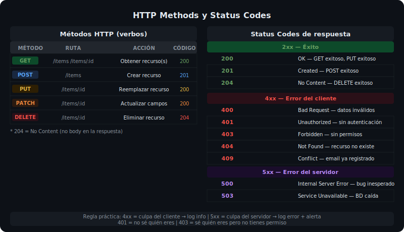

# El Ciclo req/res en Express

## 🎯 Objetivos

Al finalizar este archivo, comprenderás:

- Las propiedades más importantes de `req` y `res`
- Cómo usar los métodos de `res` correctamente (json, status, send, redirect)
- Los códigos de estado HTTP y cuándo usar cada uno
- Por qué no se puede enviar una respuesta dos veces



## 📋 El Objeto req (Request)

`req` contiene toda la información de la petición entrante:

```ts
import { Request } from 'express';

router.post('/products/:id/reviews', (req: Request, res) => {
  // ── Ruta ────────────────────────────────────────────────
  req.method;        // "POST"
  req.path;          // "/products/123/reviews"
  req.url;           // "/products/123/reviews?filter=best"
  req.baseUrl;       // "/api/v1" (prefijo del router)

  // ── Parámetros ──────────────────────────────────────────
  req.params.id;     // "123" (siempre string)

  // ── Query string ────────────────────────────────────────
  req.query.filter;  // "best" (siempre string | string[])

  // ── Body (requiere express.json()) ──────────────────────
  req.body;          // { rating: 5, comment: "Great!" }

  // ── Headers ─────────────────────────────────────────────
  req.headers['content-type'];     // "application/json"
  req.headers['authorization'];    // "Bearer eyJhbGci..."
  req.get('x-api-key');            // helper: req.get(headerName)

  // ── IP y protocolo ──────────────────────────────────────
  req.ip;            // "127.0.0.1"
  req.protocol;      // "http" o "https"
  req.secure;        // true si https

  res.json({ ok: true });
});
```

## 📋 El Objeto res (Response)

`res` controla la respuesta que se envía al cliente:

```ts
import { Response } from 'express';

// ── Enviar JSON (el más usado en APIs) ───────────────────────
res.json({ data: [] });                    // 200 implícito
res.status(201).json({ id: 'abc' });       // 201 Created
res.status(404).json({ error: 'Not found' });

// ── Encadenar status + json ──────────────────────────────────
// status() retorna 'this' — se puede encadenar
res.status(400).json({ error: 'Bad request' });

// ── Solo status, sin body ────────────────────────────────────
res.status(204).send();    // 204 No Content (DELETE exitoso)
res.sendStatus(204);       // equivalente más corto

// ── Redirigir ────────────────────────────────────────────────
res.redirect(301, 'https://example.com/new-url');
res.redirect('/api/v2/products'); // 302 temporal

// ── Headers personalizados ───────────────────────────────────
res.set('X-Request-Id', crypto.randomUUID());
res.set('Cache-Control', 'no-store');

// ❌ NUNCA enviar dos respuestas
res.json({ ok: true });
res.json({ error: 'ops' }); // Error: Cannot set headers after they are sent
```

## 📋 Códigos de Estado HTTP para APIs REST

```ts
// ── 2xx Success ──────────────────────────────────────────────
res.status(200).json(data);          // OK — GET, PUT exitosos
res.status(201).json(createdItem);   // Created — POST exitoso
res.status(204).send();              // No Content — DELETE exitoso

// ── 4xx Client Errors ────────────────────────────────────────
res.status(400).json({ error: 'Validation failed', details: [...] }); // Bad Request
res.status(401).json({ error: 'Authentication required' });           // Unauthorized
res.status(403).json({ error: 'Insufficient permissions' });          // Forbidden
res.status(404).json({ error: 'Resource not found' });                // Not Found
res.status(409).json({ error: 'Email already exists' });              // Conflict

// ── 5xx Server Errors ────────────────────────────────────────
res.status(500).json({ error: 'Internal server error' }); // Error inesperado
res.status(503).json({ error: 'Service unavailable' });   // BD caída, etc.
```

## 📋 Contrato de Respuesta Consistente

Una buena API usa siempre el mismo formato de respuesta:

```ts
// ✅ Respuestas consistentes — el cliente siempre sabe qué esperar

// Éxito con datos
res.json({
  data: { id: '123', name: 'Laptop' },
  message: 'Product retrieved successfully',
});

// Éxito con lista paginada
res.json({
  data: [{ id: '1' }, { id: '2' }],
  total: 50,
  page: 1,
  limit: 10,
});

// Error
res.status(400).json({
  error: 'VALIDATION_ERROR',
  message: 'Invalid input data',
  details: [{ field: 'email', message: 'Invalid email format' }],
});
```

## 📋 Evitar Headers Already Sent

El error más común con `res` es llamarlo dos veces. Usa `return` para evitarlo:

```ts
router.get('/:id', async (req, res) => {
  const product = await findById(req.params.id);

  if (!product) {
    res.status(404).json({ error: 'Not found' });
    return; // ← terminar aquí; sin return, el código sigue
  }

  res.json({ data: product }); // solo se ejecuta si hay producto
});
```

## 📚 Recursos Adicionales

- [MDN — HTTP Status Codes](https://developer.mozilla.org/en-US/docs/Web/HTTP/Status)
- [Express 5 — res API](https://expressjs.com/en/5x/api.html#res)

## ✅ Checklist de Verificación

- [ ] Siempre se usa `return` después de `res.json()` en condicionales
- [ ] Los códigos de estado son semánticamente correctos (201 para POST, 204 para DELETE)
- [ ] Las respuestas de error incluyen un campo `error` descriptivo
- [ ] Nunca se mezcla `res.json()` y `res.send()` en el mismo handler
- [ ] Los headers personalizados usan el prefijo `X-` si son no estándar
