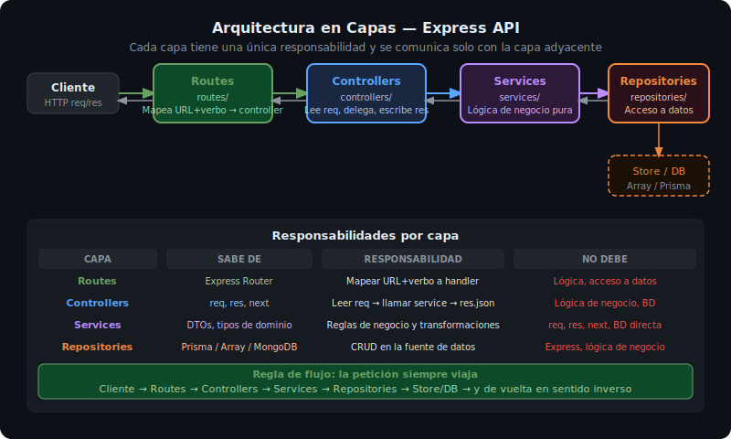

# Arquitectura en Capas

## 🎯 Objetivos

Al finalizar este archivo, comprenderás:

- Por qué separar una aplicación Express en capas
- Qué responsabilidad tiene cada capa
- Cómo se comunican las capas entre sí
- Qué es el principio de responsabilidad única (SRP)



## 📋 ¿Por qué separar en capas?

En la semana 02 construimos una app plana donde todo vivía en un solo archivo o en pocas funciones mezcladas. Eso funciona para demos, pero en una API real tiene problemas:

- **Difícil de testear**: no se puede probar la lógica sin levantar el servidor
- **Difícil de mantener**: cambiar la BD requiere tocar el controller
- **Sin reutilización**: la lógica está acoplada a Express (req/res)

La arquitectura en capas resuelve esto asignando una sola responsabilidad a cada capa.

## 📚 Las 4 Capas

### 1. Routes — El mapa de la API

La capa de routes solo define qué URL + verbo HTTP corresponde a qué controller. No tiene lógica.

```ts
// src/routes/products.routes.ts
import { Router } from 'express';
import * as productsController from '../controllers/products.controller.js';

export const productsRouter = Router();

productsRouter.get('/', productsController.getAll);
productsRouter.get('/:id', productsController.getById);
productsRouter.post('/', productsController.create);
productsRouter.put('/:id', productsController.update);
productsRouter.delete('/:id', productsController.remove);
```

### 2. Controllers — La interfaz HTTP

El controller es la única capa que conoce Express (`req`, `res`, `next`). Su responsabilidad es:

1. Extraer datos de `req` (params, body, query)
2. Llamar al service con esos datos
3. Responder con `res.json()`

```ts
// src/controllers/products.controller.ts
import type { Request, Response, NextFunction } from 'express';
import * as productsService from '../services/products.service.js';

export async function getAll(req: Request, res: Response, next: NextFunction): Promise<void> {
  try {
    const page = Number(req.query.page ?? 1);
    const limit = Number(req.query.limit ?? 10);
    const result = await productsService.findAll({ page, limit });
    res.json(result);
  } catch (err) {
    next(err); // Express 5: también se puede omitir el try/catch
  }
}

export async function getById(req: Request, res: Response, next: NextFunction): Promise<void> {
  try {
    const product = await productsService.findById(Number(req.params.id));
    if (!product) {
      res.status(404).json({ error: 'Not found', message: 'Product not found' });
      return;
    }
    res.json({ data: product });
  } catch (err) {
    next(err);
  }
}
```

> **Regla de oro**: Si el controller tiene un `if`, un bucle o un cálculo, está mal — esa lógica pertenece al service.

### 3. Services — La lógica de negocio

El service contiene las reglas del dominio. No sabe nada de Express ni de HTTP. Esto lo hace fácilmente testeable con Jest sin levantar un servidor.

```ts
// src/services/products.service.ts
import * as productsRepository from '../repositories/products.repository.js';
import type { CreateProductDto, UpdateProductDto, PaginationParams } from '../types.js';

export async function findAll(params: PaginationParams) {
  const all = await productsRepository.findAll();
  const total = all.length;
  const start = (params.page - 1) * params.limit;
  const data = all.slice(start, start + params.limit);

  return { data, total, page: params.page, limit: params.limit };
}

export async function findById(id: number) {
  return productsRepository.findById(id);
}

export async function create(dto: CreateProductDto) {
  // Aquí podrían ir validaciones de negocio, cálculos, etc.
  return productsRepository.create(dto);
}
```

### 4. Repositories — El acceso a datos

El repository es el único lugar donde se habla con la base de datos (o el store en memoria). Si mañana cambias de Prisma a MongoDB, solo cambias esta capa.

```ts
// src/repositories/products.repository.ts
import type { Product, CreateProductDto } from '../types.js';

// En semana 03 usamos memoria; en semana 05 reemplazaremos por Prisma
const products: Product[] = [];
let nextId = 1;

export async function findAll(): Promise<Product[]> {
  return [...products]; // copia defensiva
}

export async function findById(id: number): Promise<Product | undefined> {
  return products.find((p) => p.id === id);
}

export async function create(dto: CreateProductDto): Promise<Product> {
  const product: Product = { id: nextId++, ...dto };
  products.push(product);
  return product;
}
```

> Los métodos del repository son `async` aunque no hagan I/O real. Cuando migremos a Prisma, la firma no cambiará.

## 📁 Estructura de Carpetas

```
src/
├── app.ts               # Configuración Express (middlewares, rutas)
├── server.ts            # Entry point (listen, signals)
├── types.ts             # Interfaces y DTOs globales
├── routes/
│   └── products.routes.ts
├── controllers/
│   └── products.controller.ts
├── services/
│   └── products.service.ts
└── repositories/
    └── products.repository.ts
```

## ✅ Checklist de Verificación

- [ ] Cada capa está en su propia carpeta
- [ ] El controller no hace cálculos ni accede a datos directamente
- [ ] El service no usa `req`, `res` ni `next`
- [ ] El repository es el único que lee/escribe datos
- [ ] Los métodos del repository son `async`
