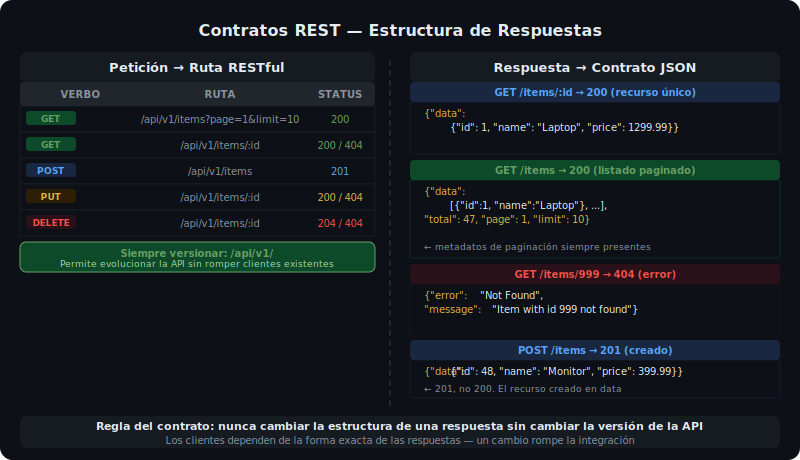

# REST y Contratos de API

## 🎯 Objetivos

Al finalizar este archivo, comprenderás:

- Qué define una API como "RESTful"
- Cómo versionar una API correctamente
- Cómo diseñar contratos de respuesta consistentes
- Qué es un response envelope (data wrapper)



## 📋 REST — Los 5 principios clave

REST (Representational State Transfer) no es un protocolo sino un estilo arquitectónico. Una API es RESTful cuando sigue estas restricciones:

| Principio | Significado práctico |
|-----------|---------------------|
| **Recursos identificables** | Cada entidad tiene una URL única: `/users/42` |
| **Verbos HTTP semánticos** | GET lee, POST crea, PUT reemplaza, DELETE elimina |
| **Sin estado** | Cada petición contiene toda la información necesaria |
| **Representación uniforme** | Respuestas en JSON consistentes |
| **Interfaz uniforme** | Convenciones predecibles para todos los recursos |

## 📚 Diseño de Rutas REST

### Convenciones de nomenclatura

```ts
// ✅ CORRECTO — plural, sustantivos, kebab-case
GET    /api/v1/products          // listar
GET    /api/v1/products/:id      // obtener uno
POST   /api/v1/products          // crear
PUT    /api/v1/products/:id      // reemplazar
PATCH  /api/v1/products/:id      // actualizar parcialmente
DELETE /api/v1/products/:id      // eliminar

// ✅ CORRECTO — relaciones anidadas
GET    /api/v1/users/:id/orders  // órdenes de un usuario
POST   /api/v1/orders/:id/items  // agregar item a una orden

// ❌ INCORRECTO — verbos en la URL
GET  /api/v1/getProducts
POST /api/v1/createProduct
GET  /api/v1/deleteProduct/:id
```

### Versioning

Siempre incluir la versión en la URL base. Esto permite evolucionar la API sin romper clientes existentes:

```ts
// Registrar versiones en app.ts
app.use('/api/v1', v1Router);  // versión actual
// app.use('/api/v2', v2Router); // futura versión — no rompe v1
```

## 📚 Contratos de Respuesta

Un contrato de API define exactamente qué estructura tendrán las respuestas. La consistencia es crítica: los clientes (frontend, mobile, otros servicios) deben poder predecir la forma de la respuesta.

### Patrón data wrapper

Envolver la respuesta en un objeto con clave `data` permite agregar metadatos sin cambiar el contrato:

```ts
// ✅ Con data wrapper — extensible
{
  "data": { "id": 1, "name": "Laptop", "price": 1299.99 }
}

// ❌ Sin wrapper — difícil de extender
{ "id": 1, "name": "Laptop", "price": 1299.99 }
```

### Respuesta de recurso individual

```ts
// GET /api/v1/products/1 → 200
{
  "data": {
    "id": 1,
    "name": "Laptop",
    "price": 1299.99,
    "category": "electronics"
  }
}
```

### Respuesta de listado paginado

```ts
// GET /api/v1/products?page=2&limit=10 → 200
{
  "data": [
    { "id": 11, "name": "Mouse", "price": 29.99 },
    { "id": 12, "name": "Teclado", "price": 79.99 }
  ],
  "total": 47,
  "page": 2,
  "limit": 10
}
```

### Respuesta de creación

```ts
// POST /api/v1/products → 201
{
  "data": {
    "id": 48,
    "name": "Monitor",
    "price": 399.99
  }
}
```

### Respuesta de error

```ts
// GET /api/v1/products/999 → 404
{
  "error": "Not Found",
  "message": "Product with id 999 does not exist"
}

// POST /api/v1/products (body inválido) → 400
{
  "error": "Bad Request",
  "message": "Validation failed",
  "details": [
    { "field": "price", "message": "price must be a positive number" }
  ]
}
```

### Implementación del contrato en TypeScript

Definir los tipos de respuesta garantiza consistencia en toda la app:

```ts
// src/types.ts

// Respuesta de recurso único
export interface SingleResponse<T> {
  data: T;
}

// Respuesta de listado paginado
export interface PaginatedResponse<T> {
  data: T[];
  total: number;
  page: number;
  limit: number;
}

// Respuesta de error
export interface ErrorResponse {
  error: string;
  message: string;
  details?: Array<{ field: string; message: string }>;
}
```

### Aplicarlo en los controllers

```ts
import type { SingleResponse, PaginatedResponse } from '../types.js';
import type { Product } from '../types.js';

// ✅ Return type explícito garantiza que se cumple el contrato
export async function getById(req: Request, res: Response<SingleResponse<Product>>, next: NextFunction) {
  const product = await productsService.findById(Number(req.params.id));
  if (!product) {
    res.status(404).json({ error: 'Not Found', message: 'Product not found' });
    return;
  }
  res.json({ data: product });
}
```

## ✅ Checklist de Verificación

- [ ] Rutas en plural y con sustantivos (no verbos)
- [ ] Prefijo `/api/v1/` en todas las rutas
- [ ] Status codes correctos: 200, 201, 204, 404, 400, 500
- [ ] Responses de éxito usan `{ data: ... }`
- [ ] Responses de listado incluyen `total`, `page`, `limit`
- [ ] Responses de error usan `{ error, message }`
- [ ] Nunca retornar el stack trace en producción
