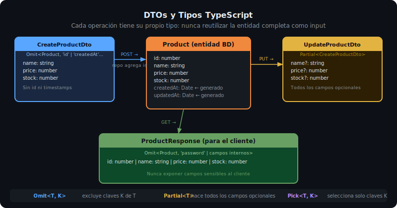

# Repositories y DTOs

## 🎯 Objetivos

Al finalizar este archivo, comprenderás:

- Qué es el patrón Repository y qué problema resuelve
- Cómo aislar el acceso a datos del resto de la aplicación
- Qué son los DTOs y cómo definirlos con TypeScript
- Por qué los repositories deben ser siempre `async`



## 📋 El Patrón Repository

El repository es la capa más interna de la arquitectura. Encapsula toda interacción con la fuente de datos (array en memoria hoy, Prisma + PostgreSQL en semana 05).

**Beneficio clave**: si cambias de base de datos, solo cambias el repository. El service, el controller y las rutas no se tocan.

```
[Controller] → [Service] → [Repository] → [Database / Store]
                                              ↑
                                    Solo esta capa conoce
                                    los detalles de almacenamiento
```

## 📚 Repository en memoria

Hoy usamos un array. En semana 05 lo reemplazaremos por Prisma sin cambiar la interfaz del repository:

```ts
// src/repositories/products.repository.ts
import type { Product, CreateProductDto, UpdateProductDto } from '../types.js';

// Store en memoria — se reemplazará por Prisma en week-05
const products: Product[] = [];
let nextId = 1;

export async function findAll(): Promise<Product[]> {
  // Retornar copia defensiva: evitar mutaciones externas
  return [...products];
}

export async function findById(id: number): Promise<Product | undefined> {
  return products.find((p) => p.id === id);
}

export async function findByName(name: string): Promise<Product | undefined> {
  return products.find((p) => p.name.toLowerCase() === name.toLowerCase());
}

export async function create(dto: CreateProductDto): Promise<Product> {
  const product: Product = { id: nextId++, ...dto };
  products.push(product);
  return { ...product }; // copia defensiva al retornar
}

export async function update(id: number, dto: UpdateProductDto): Promise<Product | undefined> {
  const index = products.findIndex((p) => p.id === id);
  if (index === -1) return undefined;
  products[index] = { ...products[index], ...dto };
  return { ...products[index] };
}

export async function remove(id: number): Promise<boolean> {
  const index = products.findIndex((p) => p.id === id);
  if (index === -1) return false;
  products.splice(index, 1);
  return true;
}
```

> **¿Por qué `async` si no hay I/O real?** Porque cuando migremos a Prisma, todos los métodos serán `async`. Definirlos `async` desde ahora evita cambiar las firmas después.

## 📚 DTOs (Data Transfer Objects)

Un DTO define la forma exacta de los datos que entran o salen de la API. Son interfaces TypeScript, no clases.

### Tipos de DTOs

```ts
// src/types.ts

// Entidad completa — lo que vive en la base de datos
export interface Product {
  id: number;
  name: string;
  description: string;
  price: number;
  stock: number;
  category: string;
  createdAt: Date;
}

// DTO de creación — lo que el cliente envía en POST
// Omit excluye los campos que genera el servidor
export type CreateProductDto = Omit<Product, 'id' | 'createdAt'>;

// DTO de actualización — todos los campos opcionales
// Partial hace todos los campos opcionales
export type UpdateProductDto = Partial<CreateProductDto>;

// DTO de paginación — parámetros de query string
export interface PaginationParams {
  page: number;
  limit: number;
}

// Respuestas genéricas del contrato de API
export interface SingleResponse<T> {
  data: T;
}

export interface PaginatedResponse<T> {
  data: T[];
  total: number;
  page: number;
  limit: number;
}

export interface ErrorResponse {
  error: string;
  message: string;
  details?: Array<{ field: string; message: string }>;
}
```

### Flujo de datos con DTOs

```
Cliente POST /products
  body: { name, description, price, stock, category }
          ↓
  Controller extrae req.body as CreateProductDto
          ↓
  Service recibe CreateProductDto
          ↓
  Repository recibe CreateProductDto, agrega id + createdAt
          ↓
  Retorna Product completo
          ↓
  Controller responde { data: Product } → 201
```

### Por qué no retornar el objeto completo al cliente

```ts
// ❌ NUNCA retornar campos sensibles al cliente
export interface User {
  id: number;
  email: string;
  password: string; // ← hash de bcrypt
  refreshToken: string; // ← token secreto
}

// ✅ DTO de respuesta — solo campos públicos
export type UserResponse = Omit<User, 'password' | 'refreshToken'>;
```

## 📚 Separar types por módulo

En proyectos grandes, conviene separar los tipos por recurso:

```
src/
└── types/
    ├── index.ts         # Re-exporta todos los tipos
    ├── product.types.ts # Product, CreateProductDto, UpdateProductDto
    ├── user.types.ts    # User, CreateUserDto, UserResponse
    └── common.types.ts  # PaginationParams, SingleResponse, PaginatedResponse
```

Para semana 03, un solo `types.ts` es suficiente.

## ✅ Checklist de Verificación

- [ ] Todos los métodos del repository son `async Promise<T>`
- [ ] El repository retorna copias de los objetos (no referencias al array)
- [ ] Existe un DTO `Create*Dto` que omite `id` y campos generados por servidor
- [ ] Existe un DTO `Update*Dto` con campos parciales (`Partial<>`)
- [ ] No se exponen campos sensibles (password, tokens) en las respuestas
- [ ] Los tipos de respuesta usan los genéricos `SingleResponse<T>` / `PaginatedResponse<T>`
