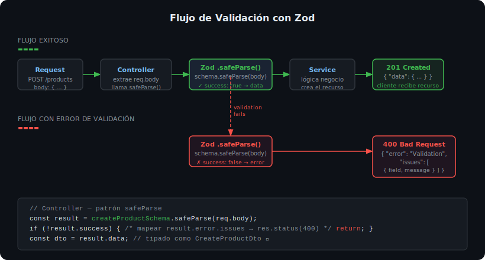

# Validación con Zod



## 🎯 Objetivos

- Entender por qué validar inputs es obligatorio en cualquier API
- Crear schemas Zod y usarlos para validar y tipar datos simultáneamente
- Manejar errores de validación con `.safeParse()` de manera segura

---

## 1. Por qué validar inputs

**La regla de oro del backend**: nunca confíes en datos que vienen del cliente.

Un cliente puede enviar:
- Campos con tipos incorrectos: `{ "price": "gratis" }` en vez de un número
- Campos faltantes: `POST /products` sin `name`
- Datos maliciosos: scripts, path traversal, valores negativos en stock

Sin validación, estos datos corrompen la base de datos o causan crashes en producción.

---

## 2. Instalación

```bash
pnpm add zod@4.3.6
```

No necesita `@types/zod`: los types están incluidos.

---

## 3. Schemas básicos

```ts
import { z } from 'zod';

// Primitivos
const nameSchema = z.string().min(1).max(100).trim();
const priceSchema = z.number().positive();
const stockSchema = z.number().int().nonnegative().default(0);

// Enum
const statusSchema = z.enum(['active', 'inactive', 'draft']);

// Objeto completo
const createProductSchema = z.object({
  name: z.string().min(1, 'El nombre es requerido').max(100).trim(),
  price: z.number({ message: 'El precio debe ser un número' }).positive('Debe ser mayor a 0'),
  stock: z.number().int().nonnegative().default(0),
  status: z.enum(['active', 'inactive']).default('active'),
});

// Para updates: todos los campos opcionales
const updateProductSchema = createProductSchema.partial();
```

---

## 4. Inferir tipos desde schemas

Con Zod no necesitas definir el interface DTO por separado:

```ts
// Sin Zod — dos fuentes de verdad (peligroso)
interface CreateProductDto { name: string; price: number; stock: number }

// Con Zod — una sola fuente de verdad ✅
const createProductSchema = z.object({ ... });
type CreateProductDto = z.infer<typeof createProductSchema>;

// TypeScript conoce exactamente los campos sin duplicar código
```

---

## 5. `.parse()` vs `.safeParse()`

```ts
// ❌ .parse() — lanza excepción si falla (solo usar con try/catch explícito)
const data = createProductSchema.parse(req.body);

// ✅ .safeParse() — retorna objeto { success, data | error } SIN lanzar excepción
const result = createProductSchema.safeParse(req.body);

if (!result.success) {
  // result.error es un ZodError con array de issues
  const issues = result.error.issues.map((issue) => ({
    field: issue.path.join('.'),
    message: issue.message,
  }));
  res.status(400).json({
    error: 'Validation Error',
    message: 'Los datos enviados no son válidos',
    issues,
  });
  return;
}

// A partir de aquí, result.data está tipado y validado
const dto: CreateProductDto = result.data;
```

---

## 6. Schemas en carpeta dedicada

Organiza los schemas en `src/schemas/`:

```ts
// src/schemas/product.schema.ts
import { z } from 'zod';

export const createProductSchema = z.object({
  name: z.string().min(1, 'El nombre es requerido').trim(),
  price: z.number().positive('El precio debe ser positivo'),
  stock: z.number().int().nonnegative().default(0),
});

export const updateProductSchema = createProductSchema.partial();

export type CreateProductDto = z.infer<typeof createProductSchema>;
export type UpdateProductDto = z.infer<typeof updateProductSchema>;
```

---

## ✅ Checklist de verificación

- [ ] `pnpm add zod@4.3.6` instalado
- [ ] Schema definido para Create y Update en `src/schemas/`
- [ ] Usas `.safeParse()` (no `.parse()` directo) en los controllers
- [ ] La respuesta 400 incluye los campos y mensajes de error de Zod
- [ ] Los tipos `CreateDto` se infieren con `z.infer<>` (no interfaces duplicadas)
