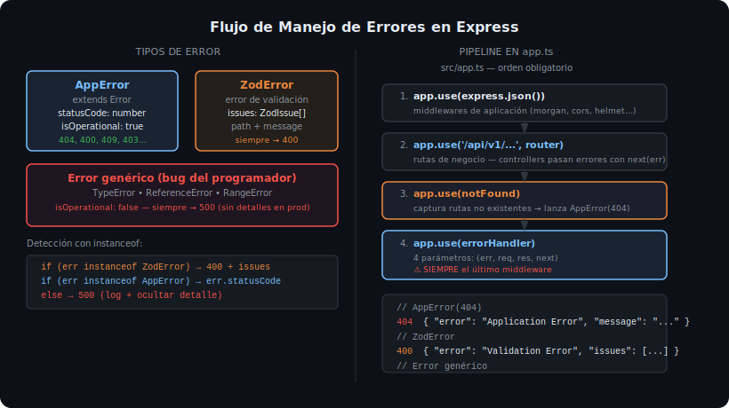

# Middleware Global de Errores



## 🎯 Objetivos

- Implementar el error handler de 4 parámetros que Express reconoce como manejador de errores
- Diferenciar `AppError`, `ZodError` y errores genéricos en un solo middleware
- Agregar el 404 handler para rutas inexistentes

---

## 1. El error handler de Express

Express identifica un middleware como **error handler** cuando tiene exactamente **4 parámetros**: `(err, req, res, next)`. Con 3 parámetros es un middleware normal.

```ts
// ❌ 3 parámetros — Express NO lo reconoce como error handler
app.use((req, res, next) => { ... });

// ✅ 4 parámetros — Express SÍ lo reconoce como error handler
app.use((err: Error, req: Request, res: Response, next: NextFunction) => { ... });
```

---

## 2. Implementación del error handler

```ts
// src/middlewares/errorHandler.ts
import { Request, Response, NextFunction } from 'express';
import { ZodError } from 'zod';
import { AppError } from '../errors/AppError';

export function errorHandler(
  err: unknown,
  _req: Request,
  res: Response,
  _next: NextFunction
): void {
  // Caso 1: Error de validación Zod (input inválido)
  if (err instanceof ZodError) {
    const issues = err.issues.map((issue) => ({
      field: issue.path.join('.'),
      message: issue.message,
    }));
    res.status(400).json({
      error: 'Validation Error',
      message: 'Los datos enviados no son válidos',
      issues,
    });
    return;
  }

  // Caso 2: Error operacional conocido (lanzado por AppError)
  if (err instanceof AppError) {
    res.status(err.statusCode).json({
      error: 'Application Error',
      message: err.message,
    });
    return;
  }

  // Caso 3: Error inesperado del programador — no exponer detalles
  console.error('[UNHANDLED ERROR]', err);
  res.status(500).json({
    error: 'Internal Server Error',
    message: 'Ocurrió un error inesperado',
    ...(process.env['NODE_ENV'] !== 'production' && {
      detail: err instanceof Error ? err.message : String(err),
    }),
  });
}
```

---

## 3. El 404 handler

El 404 handler va **antes** del error handler pero **después** de todas las rutas. Captura cualquier petición que no coincidió con ninguna ruta:

```ts
// src/middlewares/notFound.ts
import { Request, Response, NextFunction } from 'express';

export function notFound(req: Request, _res: Response, next: NextFunction): void {
  // Pasamos un AppError para que lo maneje el error handler
  const { AppError } = require('../errors/AppError');
  next(new AppError(404, `Ruta ${req.method} ${req.path} no encontrada`));
}
```

---

## 4. Orden en app.ts

El orden de los middlewares es crítico en Express:

```ts
// src/app.ts
import express from 'express';
import { productsRouter } from './routes/products.routes';
import { notFound } from './middlewares/notFound';
import { errorHandler } from './middlewares/errorHandler';

const app = express();

// 1. Middlewares de aplicación
app.use(express.json());
app.use(morgan());

// 2. Rutas
app.use('/api/v1/products', productsRouter);

// 3. 404 handler — después de las rutas, antes del error handler
app.use(notFound);

// 4. Error handler — SIEMPRE el último middleware
app.use(errorHandler);

export default app;
```

---

## 5. Pasar errores desde controllers

Todos los errores deben llegar al error handler vía `next(err)`:

```ts
// controller
export async function getById(req: Request, res: Response, next: NextFunction) {
  try {
    const id = parseInt(req.params['id']);
    const product = await service.findById(id); // lanza AppError(404) si no existe
    res.json({ data: product });
  } catch (err) {
    next(err); // ← siempre pasar a next, nunca re-throw
  }
}
```

---

## ✅ Checklist de verificación

- [ ] `errorHandler` tiene exactamente 4 parámetros
- [ ] `errorHandler` es el ÚLTIMO `app.use()` en `app.ts`
- [ ] `notFound` está ANTES del `errorHandler`
- [ ] Todos los `catch` en controllers llaman `next(err)`
- [ ] El error handler distingue `ZodError`, `AppError` y `Error` genérico
- [ ] Stack trace solo aparece cuando `NODE_ENV !== 'production'`
