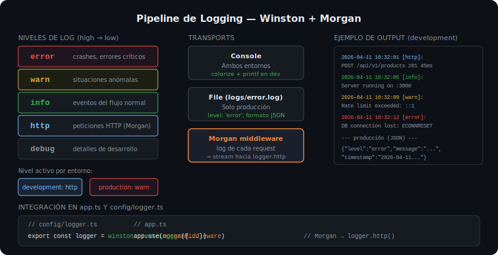

# Logging con Winston y Morgan



## 🎯 Objetivos

- Entender por qué `console.log` no es suficiente en producción
- Configurar Winston con niveles, formatos y transports
- Integrar Morgan para logs de peticiones HTTP automáticos

---

## 1. Por qué no usar `console.log`

| Problema | `console.log` | Winston |
|----------|:-------------:|:-------:|
| Niveles (error/warn/info) | ❌ No tiene | ✅ Sí |
| Silenciar en tests | ❌ No fácil | ✅ `level: 'silent'` |
| Output a archivo | ❌ Manual | ✅ Transport File |
| Formato JSON (para Datadog/Logtail) | ❌ No | ✅ `format.json()` |
| Timestamp automático | ❌ No | ✅ `format.timestamp()` |
| Deshabilitar en producción | ❌ No fácil | ✅ `level: 'error'` |

---

## 2. Instalación

```bash
pnpm add winston@3.19.0 morgan@1.10.1
pnpm add -D @types/morgan@1.9.10
```

Winston incluye sus propios types. Morgan necesita `@types/morgan`.

---

## 3. Niveles de Winston

De mayor a menor severidad:

```
error  → errores que requieren atención inmediata
warn   → situaciones anómalas pero controladas
info   → eventos del flujo normal (servidor iniciado, conexión DB)
http   → logs de peticiones HTTP (Morgan los envía aquí)
debug  → detalles de debugging (solo en desarrollo)
```

Si el nivel configurado es `info`, se muestran: `error`, `warn`, `info` (no `http` ni `debug`).

---

## 4. Configurar el logger

```ts
// src/config/logger.ts
import winston from 'winston';

const isProduction = process.env['NODE_ENV'] === 'production';

export const logger = winston.createLogger({
  // En prod: solo error y warn. En dev: todo hasta http
  level: isProduction ? 'warn' : 'http',

  format: winston.format.combine(
    winston.format.timestamp({ format: 'YYYY-MM-DD HH:mm:ss' }),
    isProduction
      ? winston.format.json()   // JSON para ingestores de logs
      : winston.format.combine(
          winston.format.colorize(),
          winston.format.printf(({ level, message, timestamp }) =>
            `${String(timestamp)} [${level}]: ${String(message)}`
          )
        )
  ),

  transports: [
    new winston.transports.Console(),
    // En producción, agregar archivo de errores
    ...(isProduction
      ? [new winston.transports.File({ filename: 'logs/error.log', level: 'error' })]
      : []),
  ],
});
```

---

## 5. Integrar Morgan con Winston

Morgan genera logs de cada petición HTTP. Lo conectamos al nivel `http` de Winston:

```ts
// src/config/logger.ts — agregar al mismo archivo
import morgan from 'morgan';

// Stream que envía los logs de Morgan a Winston
const morganStream = {
  write: (message: string) => logger.http(message.trim()),
};

export const morganMiddleware = morgan('dev', { stream: morganStream });
// En producción, cambiar 'dev' por 'combined' (más info: IP, user-agent)
```

```ts
// src/app.ts — usar el middleware
import { morganMiddleware } from './config/logger';

app.use(morganMiddleware);
```

---

## 6. Usar el logger en el código

```ts
import { logger } from '../config/logger';

// En error handler
logger.error(`Error no manejado: ${err instanceof Error ? err.message : String(err)}`);

// En server.ts
logger.info(`Servidor corriendo en http://localhost:${PORT}`);

// En services (para debugging)
logger.debug(`Buscando producto con id ${id}`);

// Nunca en producción crítica — usar nivel adecuado
```

---

## ✅ Checklist de verificación

- [ ] `winston@3.19.0` y `morgan@1.10.1` instalados con versiones exactas
- [ ] Logger configurado en `src/config/logger.ts`
- [ ] Nivel controlado por `NODE_ENV` (warn en prod, http en dev)
- [ ] Morgan conectado al stream de Winston (`logger.http`)
- [ ] `morganMiddleware` registrado en `app.ts` antes de las rutas
- [ ] Error handler usa `logger.error()` en lugar de `console.error()`
- [ ] No hay `console.log()` en el código (reemplazado por `logger.*`)
