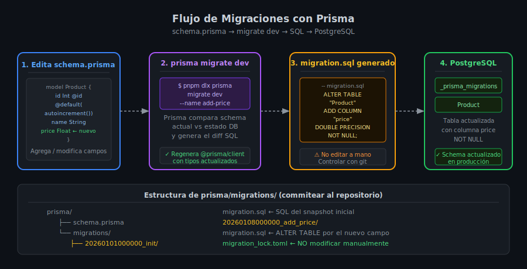

# Prisma ORM — Schema y Configuración

## 🎯 Objetivos

- Instalar y configurar Prisma en un proyecto Express + TypeScript
- Entender la estructura de `schema.prisma`: generator, datasource y models
- Definir modelos con tipos, modificadores y atributos de campo
- Ejecutar la primera migración con `prisma migrate dev`
- Usar Prisma Studio para explorar y editar datos visualmente



---

## 1. Instalación

```bash
# CLI de Prisma (solo en devDependencies)
pnpm add -D prisma@7.7.0

# Cliente generado (en dependencies — se usa en runtime)
pnpm add @prisma/client@7.7.0

# Inicializa Prisma en el proyecto (crea prisma/schema.prisma y .env)
pnpm dlx prisma init
```

Tras `prisma init`, el proyecto queda así:

```
project/
├── prisma/
│   └── schema.prisma    ← describe tu base de datos
├── .env                 ← DATABASE_URL (ignorado en .gitignore)
└── .env.example         ← template sin secretos (commiteado)
```

---

## 2. `schema.prisma` — estructura

El archivo tiene tres secciones:

```prisma
// prisma/schema.prisma

// 1. Generator — qué cliente se genera
generator client {
  provider = "prisma-client-js"
}

// 2. Datasource — conexión a la base de datos
datasource db {
  provider = "postgresql"
  url      = env("DATABASE_URL")
}

// 3. Models — las tablas de tu base de datos
model Product {
  id          Int      @id @default(autoincrement())
  name        String
  price       Float
  stock       Int      @default(0)
  createdAt   DateTime @default(now())
  updatedAt   DateTime @updatedAt
}
```

---

## 3. Tipos de datos en Prisma

| Tipo Prisma | SQL generado | TypeScript |
|-------------|-------------|-----------|
| `String` | `TEXT` | `string` |
| `Int` | `INTEGER` | `number` |
| `Float` | `DOUBLE PRECISION` | `number` |
| `Decimal` | `DECIMAL(65,30)` | `Decimal` |
| `Boolean` | `BOOLEAN` | `boolean` |
| `DateTime` | `TIMESTAMP(3)` | `Date` |

---

## 4. Modificadores de campo

```prisma
model Product {
  id        Int      @id @default(autoincrement()) // PK autoincremental
  name      String   @unique                        // Constraint UNIQUE
  slug      String?                                 // Campo opcional (NULL permitido)
  stock     Int      @default(0)                    // Valor por defecto
  createdAt DateTime @default(now())                // Fecha de inserción
  updatedAt DateTime @updatedAt                     // Actualizado automáticamente
}
```

| Modificador | Significado |
|-------------|------------|
| `@id` | Primary Key |
| `@unique` | Constraint UNIQUE en la columna |
| `@default(...)` | Valor por defecto |
| `?` al final del tipo | Campo opcional (nullable) |
| `@updatedAt` | Actualizado automáticamente en cada `update` |
| `@@unique([a, b])` | Unique constraint compuesto de 2+ columnas |

---

## 5. Primera migración

Después de definir el modelo, ejecuta:

```bash
pnpm dlx prisma migrate dev --name init
```

Esto hace tres cosas:
1. Genera el SQL de la migración en `prisma/migrations/`
2. Ejecuta el SQL contra tu PostgreSQL
3. Regenera el Prisma Client con los tipos nuevos

```
prisma/migrations/
└── 20260101000000_init/
    └── migration.sql   ← SQL generado automáticamente
```

> **Importante**: nunca edites `migration.sql` a mano. Modifica `schema.prisma`
> y ejecuta otro `prisma migrate dev`.

---

## 6. Singleton de Prisma Client

Crea un cliente singleton para evitar múltiples conexiones en desarrollo:

```ts
// src/lib/prisma.ts
import { PrismaClient } from '@prisma/client';

// Previene múltiples instancias en hot-reload de desarrollo
const globalForPrisma = global as unknown as { prisma: PrismaClient };

export const prisma =
  globalForPrisma.prisma ?? new PrismaClient({ log: ['query', 'warn', 'error'] });

if (process.env['NODE_ENV'] !== 'production') {
  globalForPrisma.prisma = prisma;
}
```

Uso en el repositorio:

```ts
// src/repositories/product.repository.ts
import { prisma } from '../lib/prisma';

export async function findAll() {
  return prisma.product.findMany();
}
```

---

## 7. Prisma Studio — GUI visual

```bash
pnpm dlx prisma studio
```

Abre `http://localhost:5555` con una interfaz para explorar, filtrar y editar datos
directamente. Útil para desarrollo y debugging.

---

## ✅ Checklist de Verificación

- [ ] `prisma/schema.prisma` tiene generator, datasource y al menos un modelo
- [ ] `.env` tiene `DATABASE_URL` correcta y está en `.gitignore`
- [ ] `.env.example` tiene `DATABASE_URL` con valores de placeholder
- [ ] `prisma/migrations/` existe y tiene la carpeta `..._init/`
- [ ] `@prisma/client` importa los tipos correctos de tu modelo
- [ ] `src/lib/prisma.ts` exporta singleton de PrismaClient
