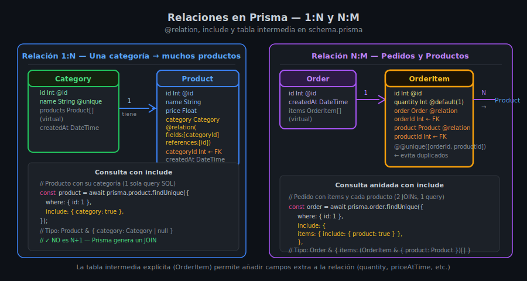

# Prisma — Relaciones, `include` y `select`

## 🎯 Objetivos

- Modelar relaciones 1:N y N:M en `schema.prisma` con `@relation`
- Usar `include` para cargar datos relacionados en una sola query
- Comparar `include` vs `select` en consultas con relaciones
- Entender el problema N+1 y cómo Prisma lo evita



---

## 1. Relación uno-a-muchos (1:N)

El caso más común: **una categoría tiene muchos productos**.

```prisma
// prisma/schema.prisma

model Category {
  id        Int       @id @default(autoincrement())
  name      String    @unique
  products  Product[]            // campo virtual (no es columna en la DB)
}

model Product {
  id          Int       @id @default(autoincrement())
  name        String
  price       Float
  category    Category  @relation(fields: [categoryId], references: [id])
  categoryId  Int                // columna FK en la tabla products
}
```

Reglas de la relación 1:N:
- La FK (`categoryId`) va en la tabla **hijo** (`Product`)
- El campo de lista (`products Product[]`) va en la tabla **padre** (`Category`) — es virtual
- `@relation(fields: [...], references: [...])` define qué columna apunta a qué

---

## 2. Relación muchos-a-muchos (N:M)

Un producto puede aparecer en muchos pedidos, y un pedido puede tener muchos productos:

```prisma
model Order {
  id        Int           @id @default(autoincrement())
  createdAt DateTime      @default(now())
  items     OrderItem[]
}

model Product {
  id    Int         @id @default(autoincrement())
  name  String
  items OrderItem[]
}

// Tabla intermedia explícita (permite campos extras como quantity)
model OrderItem {
  id        Int     @id @default(autoincrement())
  quantity  Int     @default(1)
  order     Order   @relation(fields: [orderId],   references: [id])
  orderId   Int
  product   Product @relation(fields: [productId], references: [id])
  productId Int

  @@unique([orderId, productId])
}
```

---

## 3. `include` — cargar datos relacionados

```ts
// Producto con su categoría
const product = await prisma.product.findUnique({
  where: { id: 1 },
  include: { category: true },
});
// Tipo: Product & { category: Category }

// Categoría con todos sus productos
const category = await prisma.category.findUnique({
  where: { id: 1 },
  include: { products: true },
});
// Tipo: Category & { products: Product[] }

// include anidado — pedido con items y los productos de cada item
const order = await prisma.order.findUnique({
  where: { id: 1 },
  include: {
    items: {
      include: { product: true },
    },
  },
});
```

---

## 4. `select` con relaciones

```ts
// Seleccionar solo campos específicos incluyendo relación
const products = await prisma.product.findMany({
  select: {
    id: true,
    name: true,
    price: true,
    category: {
      select: { name: true }, // solo el nombre de la categoría
    },
  },
});
// Tipo: { id: number; name: string; price: number; category: { name: string } | null }[]
```

> No puedes usar `include` y `select` simultáneamente en la misma query.
> Elige uno: `include` devuelve el modelo completo relacionado; `select` permite proyección.

---

## 5. El problema N+1 y cómo Prisma lo evita

El **problema N+1** ocurre cuando cargamos una lista y luego hacemos una query por
cada elemento para obtener datos relacionados:

```ts
// ❌ MAL — N+1: 1 query para products + N queries para categories
const products = await prisma.product.findMany();
for (const p of products) {
  const cat = await prisma.category.findUnique({ where: { id: p.categoryId } });
  // ... N queries extra
}

// ✅ BIEN — 1 sola query con JOIN (Prisma lo genera automáticamente)
const products = await prisma.product.findMany({
  include: { category: true },
});
```

Prisma genera un `JOIN` SQL cuando usas `include`, evitando el problema N+1.

---

## 6. `onDelete` — comportamiento al eliminar el padre

```prisma
model Product {
  id         Int       @id @default(autoincrement())
  category   Category? @relation(fields: [categoryId], references: [id], onDelete: SetNull)
  categoryId Int?
}
```

| `onDelete` | Comportamiento |
|------------|---------------|
| `Restrict` (default) | Error si el padre tiene hijos — protege integridad |
| `Cascade` | Elimina los hijos automáticamente al eliminar el padre |
| `SetNull` | Pone la FK en `null` — requiere que el campo sea opcional (`?`) |
| `NoAction` | Igual que `Restrict` pero con diferencia en timing |

---

## 7. Migración tras añadir relación

Al agregar una relación al `schema.prisma`, crea una nueva migración:

```bash
pnpm dlx prisma migrate dev --name add-category-relation
```

Prisma generará un `ALTER TABLE` que añade la columna FK y el constraint.

---

## ✅ Checklist de Verificación

- [ ] `schema.prisma` tiene al menos una relación 1:N definida correctamente
- [ ] La FK (`categoryId`) está en la tabla hijo, no en la padre
- [ ] Migración de la relación ejecutada sin errores
- [ ] `include` carga la relación en una sola query (no en loop)
- [ ] Manejo de `P2003` (FK constraint fail) en el repositorio si aplica
- [ ] Entiendes por qué `include` evita el problema N+1
