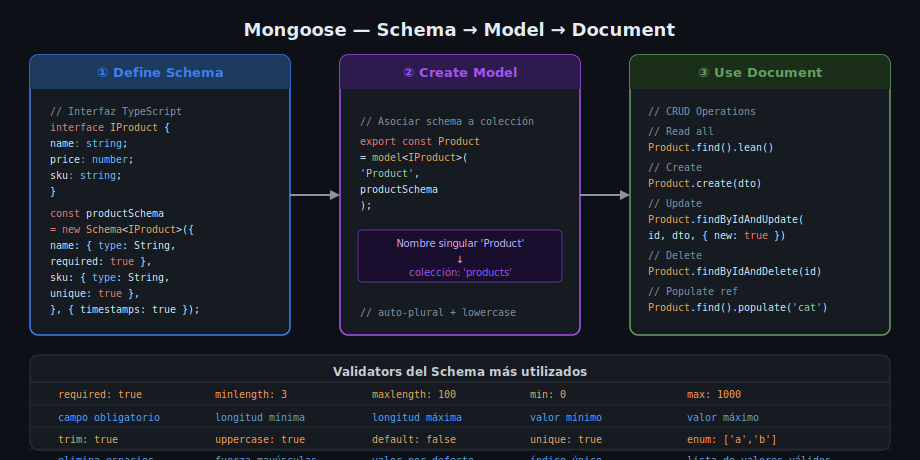

# Mongoose — Schema, Tipos y Validadores

## 🎯 Objetivos

- Conectar a MongoDB desde Node.js usando Mongoose
- Definir schemas con tipos, validadores e índices
- Usar `timestamps`, virtuals y middleware pre/post

## Instalación

```bash
pnpm add mongoose@9.4.1
pnpm add -D @types/node@22.15.21
```

> Mongoose 9 incluye sus propios tipos TypeScript. No se necesita `@types/mongoose`.

## Conexión — `connectDB`

A diferencia de Prisma que expone un cliente, **Mongoose mantiene un estado de conexión global**. Basta llamar `mongoose.connect()` una sola vez al inicio y todos los modelos la usan automáticamente.

```ts
// src/lib/mongoose.ts
import mongoose from 'mongoose';

export async function connectDB(): Promise<void> {
  const uri = process.env['MONGODB_URI'];
  if (!uri) throw new Error('MONGODB_URI is not defined');

  await mongoose.connect(uri, {
    // serverSelectionTimeoutMS: 5000 — falla rápido si MongoDB no está
  });
  console.log('MongoDB connected');
}

export async function disconnectDB(): Promise<void> {
  await mongoose.disconnect();
}
```

```ts
// src/server.ts — llamar ANTES de app.listen()
import { connectDB } from './lib/mongoose';

await connectDB();
app.listen(PORT, () => console.log(`Server on ${PORT}`));
```

## Schema — La Definición del Documento



Un `Schema` define la estructura, tipos y validadores de los documentos. Un `Model` es la clase TypeScript que interactúa con la colección.

```ts
// src/models/product.model.ts
import { Schema, model } from 'mongoose';

// 1. Interfaz TypeScript para el documento
interface IProduct {
  name: string;
  description?: string;
  price: number;
  stock: number;
  sku: string;
  active: boolean;
  createdAt: Date;  // añadido por `timestamps: true`
  updatedAt: Date;
}

// 2. Schema con tipos y validadores
const productSchema = new Schema<IProduct>(
  {
    name: {
      type: String,
      required: [true, 'El nombre es requerido'],
      trim: true,        // elimina espacios al inicio/fin
      maxlength: [100, 'El nombre no puede superar 100 caracteres'],
    },
    description: {
      type: String,
      maxlength: 500,
    },
    price: {
      type: Number,
      required: true,
      min: [0, 'El precio no puede ser negativo'],
    },
    stock: {
      type: Number,
      default: 0,
      min: 0,
    },
    sku: {
      type: String,
      required: true,
      unique: true,       // crea índice UNIQUE en MongoDB
      uppercase: true,    // transforma el valor a mayúsculas antes de guardar
    },
    active: {
      type: Boolean,
      default: true,
    },
  },
  {
    timestamps: true, // añade createdAt y updatedAt automáticamente
  },
);

// 3. Exportar el Model (nombre en PascalCase singular → colección plural automática)
// 'Product' → colección 'products'
export const Product = model<IProduct>('Product', productSchema);
```

## SchemaTypes — Referencia Rápida

| Tipo Mongoose | TypeScript | Ejemplo |
|--------------|------------|---------|
| `String` | `string` | `{ type: String, required: true }` |
| `Number` | `number` | `{ type: Number, min: 0 }` |
| `Boolean` | `boolean` | `{ type: Boolean, default: false }` |
| `Date` | `Date` | `{ type: Date, default: Date.now }` |
| `Schema.Types.ObjectId` | `Types.ObjectId` | `{ type: ObjectId, ref: 'Category' }` |
| `[String]` | `string[]` | `{ type: [String], default: [] }` |
| `Schema.Types.Mixed` | `unknown` | Para objetos sin estructura fija |

## Validadores Built-in

```ts
{
  // String
  required: true,
  minlength: 3,
  maxlength: 100,
  trim: true,
  lowercase: true,
  uppercase: true,
  enum: ['admin', 'user', 'moderator'],
  match: [/^[a-z]+$/, 'Solo letras minúsculas'],

  // Number
  min: 0,
  max: 100,

  // Mensaje de error personalizado
  required: [true, 'El campo es obligatorio'],
  min: [1, 'Debe ser mayor a 0'],
}
```

## Índices

```ts
// Índice único en un campo
sku: { type: String, unique: true }

// Índice compuesto (al final del schema)
productSchema.index({ name: 'text' });           // búsqueda full-text
productSchema.index({ price: 1, active: -1 });   // compuesto: price ASC, active DESC
```

## Virtual Fields

Los virtuals son propiedades calculadas que **no se persisten** en la base de datos:

```ts
// Campo virtual: precio con IVA
productSchema.virtual('priceWithTax').get(function (this: IProduct) {
  return this.price * 1.19;
});

// Para que aparezca en .toJSON() / respuestas JSON:
const productSchema = new Schema<IProduct>({ ... }, {
  timestamps: true,
  toJSON: { virtuals: true },
});
```

## Middleware Pre/Post

Hooks que se ejecutan antes o después de ciertas operaciones:

```ts
// Pre-save: ejecuta antes de guardar (crear o actualizar con .save())
productSchema.pre('save', function (next) {
  // `this` es el documento que se va a guardar
  this.sku = this.sku.toUpperCase();
  next();
});

// Post-find: ejecuta después de cualquier query find
productSchema.post('findOneAndDelete', function (doc) {
  if (doc) {
    console.log(`Producto eliminado: ${doc.name}`);
  }
});
```

## ✅ Checklist de Verificación

- [ ] `connectDB()` lanza error explícito si `MONGODB_URI` no está definida
- [ ] `connectDB()` se llama en `server.ts`, antes de `app.listen()`
- [ ] Todos los campos tienen tipo explícito (no solo `type: String` sin más)
- [ ] Los campos obligatorios tienen `required: true` o `required: [true, 'mensaje']`
- [ ] `{ timestamps: true }` está presente en el schema
- [ ] El campo que debe ser único tiene `unique: true`
- [ ] Los modelos se importan con `import { Product } from '../models/product.model'`
