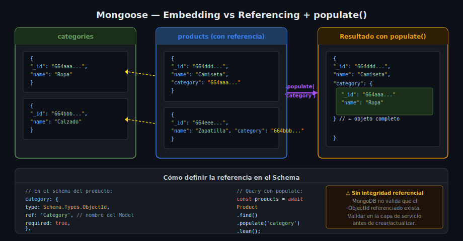

# Mongoose — Relaciones: Embedding vs Referencing

## 🎯 Objetivos

- Elegir entre embedding y referencing según el caso de uso
- Definir referencias con `Schema.Types.ObjectId` y `ref`
- Cargar documentos relacionados con `populate()`

## Dos Estrategias para Relaciones

MongoDB **no tiene JOINs** en el sentido relacional, pero ofrece dos formas de modelar relaciones:



### Embedding — Documentos Anidados

Los datos relacionados se almacenan **dentro del mismo documento**:

```ts
// El address está directamente dentro de user
{
  "_id": "664abc...",
  "name": "Ana García",
  "address": {           // ← embebido
    "street": "Calle 10 #5-20",
    "city": "Bogotá",
    "country": "CO"
  }
}
```

**Usar embedding cuando:**
- Relación 1:1 (perfil → dirección)
- Relación 1:N donde N es pequeño y acotado (pedido → ítems, máx ~100)
- Los datos relacionados **siempre** se consultan juntos
- Los datos relacionados **no tienen identidad propia** (no se consultan solos)

**Drawbacks del embedding:**
- Límite de 16 MB por documento en MongoDB
- Actualizaciones en arrays grandes pueden ser costosas
- Redundancia de datos si el subdocumento se repite (ej. misma categoría en 1000 productos)

### Referencing — Documentos Relacionados por ID

Los datos relacionados **viven en su propia colección** y se enlazan por `ObjectId`:

```ts
// products collection
{
  "_id": "664def...",
  "name": "Camiseta Polo",
  "price": 59900,
  "category": "664abc..."  // ← solo el ObjectId
}

// categories collection
{
  "_id": "664abc...",
  "name": "Ropa",
  "description": "Prendas de vestir"
}
```

**Usar referencing cuando:**
- Los documentos relacionados se consultan independientemente
- Relación 1:N con N potencialmente grande
- Relación N:M
- Los datos del relacionado cambian frecuentemente (evitar redundancia)

## Definir Referencia en el Schema

```ts
// src/models/product.model.ts
import { Schema, model, Types } from 'mongoose';

interface IProduct {
  name: string;
  price: number;
  category: Types.ObjectId;  // referencia — almacena solo el ObjectId
}

const productSchema = new Schema<IProduct>({
  name:  { type: String, required: true },
  price: { type: Number, required: true, min: 0 },
  category: {
    type: Schema.Types.ObjectId,  // tipo especial para referencias
    ref: 'Category',              // nombre del Model al que apunta
    required: true,
  },
}, { timestamps: true });

export const Product = model<IProduct>('Product', productSchema);
```

## `populate()` — Cargar el Documento Relacionado

`populate()` reemplaza el `ObjectId` por el documento completo al momento de la consulta:

```ts
// Sin populate — devuelve el ObjectId como string
const product = await Product.findById(id).lean();
// { _id: '664def...', name: 'Camiseta', category: '664abc...' }

// Con populate — devuelve el objeto completo
const product = await Product.findById(id).populate('category').lean();
// { _id: '664def...', name: 'Camiseta', category: { _id: '664abc...', name: 'Ropa', ... } }
```

### Populate en findAll (con paginación)

```ts
const products = await Product.find()
  .populate('category')
  .sort({ createdAt: -1 })
  .skip(skip)
  .limit(limit)
  .lean();
```

### Populate selectivo — traer solo ciertos campos

```ts
// Solo traer  name y description de category (excluir __v)
const product = await Product.findById(id)
  .populate('category', 'name description -__v')
  .lean();
```

### Populate anidado — relaciones de dos niveles

```ts
// Order tiene items[], y cada item tiene un product (ObjectId)
const order = await Order.findById(id)
  .populate({
    path: 'items',
    populate: {
      path: 'product',
      select: 'name price sku',
    },
  })
  .lean();
```

## Tipo TypeScript con Populate

Para tipar correctamente el resultado de populate:

```ts
import { Types } from 'mongoose';

// Tipo del documento Category
interface ICategory {
  name: string;
  description?: string;
}

// Tipo del producto con category sin popular (solo ObjectId)
interface IProduct {
  name: string;
  price: number;
  category: Types.ObjectId;
}

// Tipo del producto con category populada
interface IProductPopulated extends Omit<IProduct, 'category'> {
  category: ICategory & { _id: Types.ObjectId };
}
```

## Validar ObjectId en Zod

El controller debe validar que el ID recibido en los params tenga formato de ObjectId antes de pasarlo al repositorio (evita CastError):

```ts
// src/schemas/product.schema.ts
import { z } from 'zod';

const objectIdRegex = /^[0-9a-fA-F]{24}$/;

export const objectIdSchema = z.string().regex(objectIdRegex, 'ID inválido');

export const createProductSchema = z.object({
  name:     z.string().min(1).max(100),
  price:    z.number().positive(),
  category: objectIdSchema,   // valida que sea un ObjectId válido
});
```

## MongoDB vs PostgreSQL — Comparativa de Relaciones

| Aspecto | PostgreSQL + Prisma | MongoDB + Mongoose |
|---------|--------------------|--------------------|
| Relaciones | FOREIGN KEY | `Schema.Types.ObjectId` + `ref` |
| Cargar relacionado | `include: { category: true }` | `.populate('category')` |
| Migraciones | `prisma migrate dev` | No existen |
| Consistencia referencial | Garantizada por FK | **No garantizada** (MongoDB no forza la referencia) |
| Relación N:M | Tabla pivote | Array de ObjectIds |
| Error unique | `P2002` | `MongoServerError code 11000` |
| Error no encontrado | `P2025` | `null` devuelto por `findById` |

> **Importante**: MongoDB **no garantiza integridad referencial**. Si eliminas una categoría, los productos que la referencian seguirán teniendo ese ObjectId (apuntando a nada). Esta responsabilidad cae en la lógica de la aplicación.

## ✅ Checklist de Verificación

- [ ] El campo de referencia usa `Schema.Types.ObjectId` como tipo y `ref: 'NombreDelModel'`
- [ ] La interfaz TypeScript usa `Types.ObjectId` (importado de `'mongoose'`) para el campo de referencia
- [ ] Los endpoints que devuelven un producto usan `.populate('category')`
- [ ] El seed inserta primero las categorías y luego los productos (las referencias deben existir)
- [ ] El schema Zod valida el campo `category` con el regex de ObjectId
- [ ] El repositorio captura `CastError` (puede ocurrir al popularle un ObjectId inválido)
