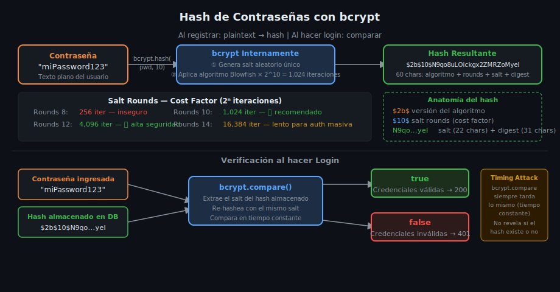

# Hash de Contraseñas con bcrypt

## 🎯 Objetivos

- Entender por qué nunca se almacenan contraseñas en texto plano
- Comprender qué es el salt y cómo protege contra ataques de diccionario
- Dominar la API de bcrypt: `hash()` y `compare()`
- Elegir el número adecuado de salt rounds para producción

## 1. Por Qué No Almacenar Contraseñas en Texto Plano

Si la base de datos es comprometida y las contraseñas están en texto plano, **todos los usuarios quedan expuestos inmediatamente**. El atacante obtiene credenciales válidas tanto para tu app como para cualquier otro sitio donde el usuario reutilice la contraseña.

### ¿Por qué MD5 y SHA-256 tampoco son seguros?

Los algoritmos de hashing genéricos (MD5, SHA-1, SHA-256) están diseñados para ser **rápidos**. Un atacante con una GPU moderna puede calcular billones de hashes por segundo, lo que hace viables los ataques de fuerza bruta.

```
MD5 / SHA-256:  ~10,000,000,000 intentos/segundo  ❌
bcrypt (r=10):          ~100 intentos/segundo  ✅
```



## 2. Qué Es el Salt

El **salt** es un valor aleatorio único generado para cada contraseña antes de hashearla. Se concatena con la contraseña antes de aplicar el algoritmo.

```
hash = bcrypt(password + salt, costFactor)
```

**¿Por qué es importante?**

Sin salt, dos usuarios con la misma contraseña tendrían el mismo hash. Un atacante podría construir una **rainbow table** (tabla precalculada de hashes comunes) y encontrar la contraseña en segundos.

Con salt único por usuario, aunque dos usuarios tengan `"password123"`, sus hashes serán completamente distintos.

```
Usuario A: bcrypt("password123" + "s4ltAleatorioA") → "$2b$10$AbCdEf..."
Usuario B: bcrypt("password123" + "s4ltAleatorioB") → "$2b$10$XyZwVu..."
```

## 3. Salt Rounds (Cost Factor)

Los **salt rounds** definen cuántas iteraciones aplica bcrypt internamente: `2^rounds`. A mayor número, más tiempo de cómputo.

| Rounds | Iteraciones | Tiempo aprox | Uso recomendado |
|--------|-------------|--------------|-----------------|
| 8 | 256 | ~1ms | Demasiado rápido, inseguro |
| 10 | 1,024 | ~100ms | ✅ Desarrollo/producción |
| 12 | 4,096 | ~400ms | ✅ Alta seguridad |
| 14 | 16,384 | ~1.5s | Demasiado lento para login masivo |

**Regla práctica**: usa `10` en desarrollo y `12` en producción crítica. Nunca bajes de `10`.

## 4. Instalación

```bash
pnpm add bcrypt@5.1.1
pnpm add -D @types/bcrypt@5.0.2
```

## 5. API de bcrypt

### Hash de contraseña — registro

```ts
import bcrypt from 'bcrypt';

const SALT_ROUNDS = 10;

async function hashPassword(plaintext: string): Promise<string> {
  // bcrypt genera el salt internamente y lo embebe en el resultado
  return bcrypt.hash(plaintext, SALT_ROUNDS);
}

// Resultado: "$2b$10$<22-char-salt><31-char-hash>"
// El hash almacena: algoritmo, rounds, salt y digest — todo junto
const hashed = await hashPassword('miContraseña123');
// "$2b$10$N9qo8uLOickgx2ZMRZoMyeIjZAgcfl7p92ldGxad68LJZdL17lhWy"
```

### Comparación — login

```ts
async function verifyPassword(plaintext: string, hash: string): Promise<boolean> {
  // bcrypt extrae el salt del hash almacenado y recalcula
  // Comparación en tiempo constante — no vulnerable a timing attacks
  return bcrypt.compare(plaintext, hash);
}

const isValid = await verifyPassword('miContraseña123', storedHash);
// true → credenciales válidas
// false → contraseña incorrecta
```

### ⚠️ Nunca usar las versiones síncronas en producción

```ts
// ❌ MAL — bloquea el event loop durante ~100ms por solicitud
const hash = bcrypt.hashSync(password, 10);
const ok = bcrypt.compareSync(password, hash);

// ✅ BIEN — async/await, no bloquea
const hash = await bcrypt.hash(password, 10);
const ok = await bcrypt.compare(password, hash);
```

## 6. Integración en Registro y Login

```ts
// ── Registro ──────────────────────────────────────────────────────────────
export async function register(dto: RegisterDto): Promise<SafeUser> {
  const existing = await usersRepository.findByEmail(dto.email);
  if (existing) {
    throw new AppError(409, 'El email ya está registrado');
  }

  const hashedPassword = await bcrypt.hash(dto.password, 10);

  const user = await usersRepository.create({
    ...dto,
    password: hashedPassword,
  });

  // Nunca devolver la contraseña hasheada en la respuesta
  const { password: _, ...safeUser } = user;
  return safeUser;
}

// ── Login ─────────────────────────────────────────────────────────────────
export async function login(dto: LoginDto): Promise<string> {
  // Primero buscar por email (con password, que normalmente está select: false)
  const user = await usersRepository.findByEmailWithPassword(dto.email);

  // IMPORTANTE: mismo mensaje para email no encontrado Y contraseña incorrecta
  // Evita user enumeration (saber qué emails existen en el sistema)
  if (!user) {
    throw new AppError(401, 'Credenciales inválidas');
  }

  const isValid = await bcrypt.compare(dto.password, user.password);
  if (!isValid) {
    throw new AppError(401, 'Credenciales inválidas');  // mismo mensaje ✅
  }

  return signAccessToken({ sub: user._id.toString(), email: user.email, role: user.role });
}
```

## ✅ Checklist de Verificación

- [ ] `bcrypt.hash()` con `saltRounds >= 10`
- [ ] `bcrypt.compare()` para verificación (nunca comparar hashes manualmente)
- [ ] Mismo mensaje de error para email no encontrado y contraseña incorrecta
- [ ] Nunca almacenar la contraseña hasheada en la respuesta HTTP
- [ ] Campo `password` con `{ select: false }` en Mongoose para evitar exposición accidental
- [ ] Usando la versión async de bcrypt (no `hashSync` ni `compareSync`)
