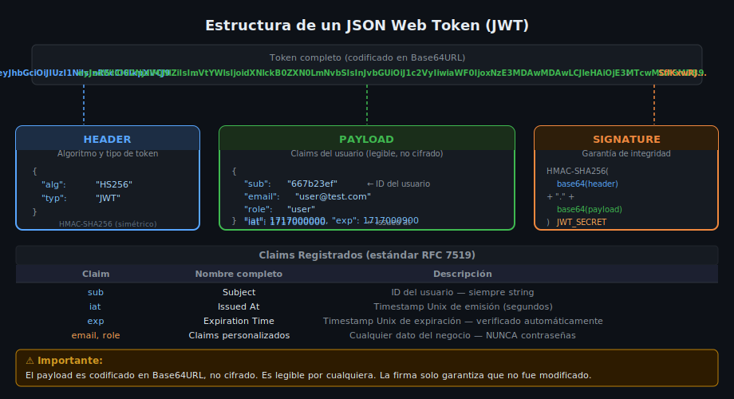

# Fundamentos de JWT

## 🎯 Objetivos

- Entender la estructura interna de un JSON Web Token
- Distinguir access token y refresh token: cuándo y cómo usarlos
- Firmar y verificar tokens con la librería `jsonwebtoken`
- Configurar secretos, expiración y claims correctamente

## 1. ¿Qué Es un JWT?

Un **JSON Web Token** es un estándar abierto (RFC 7519) para transmitir información entre partes como un objeto JSON firmado digitalmente. Es **compacto**, **self-contained** (contiene toda la información necesaria) y **verificable** sin consultar la base de datos.

```
eyJhbGciOiJIUzI1NiIsInR5cCI6IkpXVCJ9
.eyJzdWIiOiI2NjdiMjNhYjEyM2FiYyIsImVtYWlsIjoidXNlckB0ZXN0LmNvbSIsInJvbGUiOiJ1c2VyIiwiaWF0IjoxNzE3MDAwMDAwLCJleHAiOjE3MTcwMDA5MDB9
.SflKxwRJSMeKKF2QT4fwpMeJf36POk6yJV_adQssw5c
```



## 2. Las Tres Partes

Un JWT tiene tres segmentos separados por `.`, cada uno codificado en Base64URL (legible, no cifrado).

### Header — Metadata del token

```json
{
  "alg": "HS256",
  "typ": "JWT"
}
```

| Campo | Valor | Descripción |
|-------|-------|-------------|
| `alg` | `HS256` | HMAC SHA-256 — firma simétrica con un secreto compartido |
| `typ` | `JWT` | Tipo de token |

### Payload — Claims (datos del portador)

```json
{
  "sub": "667b23ab123abc",
  "email": "user@test.com",
  "role": "user",
  "iat": 1717000000,
  "exp": 1717000900
}
```

| Claim | Tipo | Descripción |
|-------|------|-------------|
| `sub` | Registered | Subject — ID del usuario (siempre string) |
| `iat` | Registered | Issued At — timestamp de emisión |
| `exp` | Registered | Expiration — timestamp de expiración |
| `email` | Custom | Datos del negocio (lo que necesites) |
| `role` | Custom | Rol del usuario para autorización |

> **⚠️ El payload es legible por cualquiera.** El token solo está codificado en Base64URL, no cifrado. Nunca incluir contraseñas, datos sensibles ni secretos en el payload.

### Signature — Garantía de integridad

```
HMAC-SHA256(
  base64url(header) + "." + base64url(payload),
  JWT_SECRET
)
```

La firma garantiza que el token **no fue modificado** desde que se emitió. Si alguien altera el payload (por ejemplo, cambia `"role": "user"` por `"role": "admin"`), la firma deja de ser válida y el servidor rechaza el token.

## 3. Access Token vs Refresh Token

| Característica | Access Token | Refresh Token |
|----------------|-------------|---------------|
| **Duración** | Corta (15 min) | Larga (7 días) |
| **Propósito** | Autorizar llamadas a la API | Obtener nuevos access tokens |
| **Transmisión** | En cada request | Solo en `/auth/refresh` |
| **Secreto** | `JWT_ACCESS_SECRET` | `JWT_REFRESH_SECRET` |
| **Almacenamiento cliente** | Cookie HttpOnly | Cookie HttpOnly |
| **Almacenamiento servidor** | No (stateless) | Sí (hash en DB para poder revocar) |

**¿Por qué dos tokens?** Si el access token fuera de larga duración (ej. 30 días) y fuera robado, el atacante tendría acceso por 30 días sin poder revocar el token. Con un access token de 15 min, el daño queda acotado. El refresh token permite renovar el acceso sin que el usuario vuelva a hacer login.

## 4. Instalación

```bash
pnpm add jsonwebtoken@9.0.2
pnpm add -D @types/jsonwebtoken@9.0.9
```

## 5. API de jsonwebtoken

### Firmar un token

```ts
import jwt from 'jsonwebtoken';

export interface JwtPayload {
  sub: string;    // user ID
  email: string;
  role: string;
}

export function signAccessToken(payload: JwtPayload): string {
  return jwt.sign(payload, process.env.JWT_ACCESS_SECRET!, {
    expiresIn: '15m',  // 15 minutos
  });
}

export function signRefreshToken(payload: Pick<JwtPayload, 'sub'>): string {
  return jwt.sign(payload, process.env.JWT_REFRESH_SECRET!, {
    expiresIn: '7d',  // 7 días
  });
}
```

### Verificar un token

```ts
export function verifyAccessToken(token: string): JwtPayload {
  // jwt.verify lanza JsonWebTokenError si la firma es inválida
  // y TokenExpiredError si el token ya expiró
  return jwt.verify(token, process.env.JWT_ACCESS_SECRET!) as JwtPayload;
}

export function verifyRefreshToken(token: string): Pick<JwtPayload, 'sub'> {
  return jwt.verify(token, process.env.JWT_REFRESH_SECRET!) as Pick<JwtPayload, 'sub'>;
}
```

### Errores de verificación

```ts
import { JsonWebTokenError, TokenExpiredError } from 'jsonwebtoken';

try {
  const decoded = verifyAccessToken(token);
} catch (err) {
  if (err instanceof TokenExpiredError) {
    // El token es válido pero su tiempo de vida expiró → 401
    throw new AppError(401, 'Token expirado');
  }
  if (err instanceof JsonWebTokenError) {
    // El token está malformado o la firma es inválida → 401
    throw new AppError(401, 'Token inválido');
  }
}
```

## 6. Variables de Entorno

```env
# Secretos distintos para cada tipo de token
# Mínimo 32 caracteres aleatorios en producción
JWT_ACCESS_SECRET=super-secreto-de-acceso-min-32-chars
JWT_REFRESH_SECRET=super-secreto-de-refresco-diferente-min-32-chars

# Duraciones (opcionales si están hardcodeadas, pero preferible en env)
JWT_ACCESS_EXPIRES_IN=15m
JWT_REFRESH_EXPIRES_IN=7d
```

> En producción, generar secretos con `openssl rand -base64 64`.

## ✅ Checklist de Verificación

- [ ] JWT_ACCESS_SECRET y JWT_REFRESH_SECRET son distintos y nunca hardcodeados
- [ ] Access token expira en máximo 15–30 minutos
- [ ] El payload no contiene la contraseña ni datos sensibles
- [ ] `jwt.verify()` envuelto en try/catch para manejar tokens expirados e inválidos
- [ ] Usar `process.env.JWT_SECRET!` con `!` solo si ya validaste que existe al arrancar el servidor
