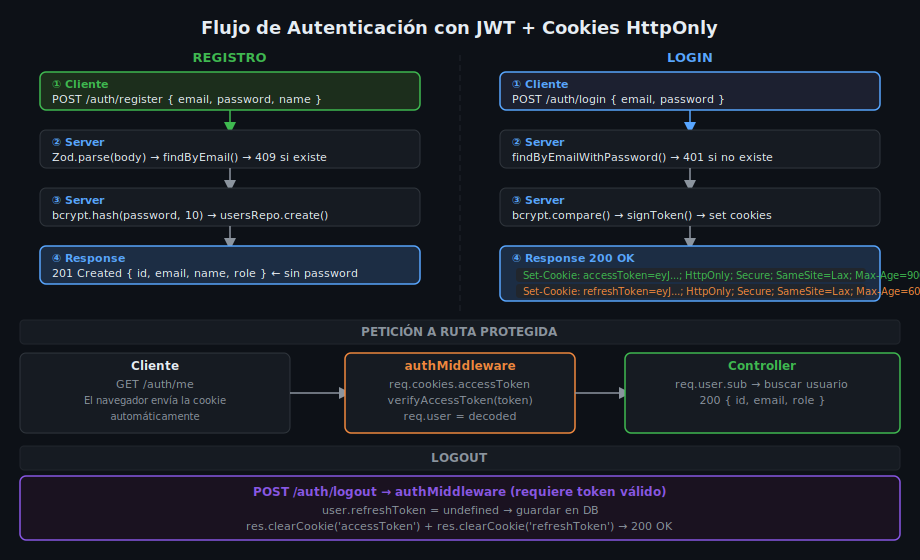

# Flujos de Autenticación y Cookies HttpOnly

## 🎯 Objetivos

- Implementar los flujos completos: registro, login, refresh y logout
- Entender por qué las cookies HttpOnly son más seguras que localStorage
- Configurar opciones de cookies para entornos de desarrollo y producción
- Comprender la rotación de refresh tokens y su importancia

## 1. Cookies HttpOnly vs localStorage

| Aspecto | localStorage | Cookie HttpOnly |
|---------|-------------|-----------------|
| Acceso desde JavaScript | ✅ `localStorage.getItem()` | ❌ Inaccesible para JS |
| Vulnerable a XSS | ✅ Un script malicioso lee el token | ❌ Script no puede leer la cookie |
| Enviada automáticamente | ❌ Hay que añadirla al header | ✅ El navegador la envía sola |
| Control de expiración | Manual | Automático con `maxAge` |
| CSRF | No aplica | Mitigado con `SameSite` |

> **Resumen**: localStorage es conveniente pero un ataque XSS expone el token al instante. Una cookie HttpOnly es invisible para JavaScript, por lo que un script inyectado no puede robarla.



## 2. Opciones de Cookie

```ts
import { Response } from 'express';

const COOKIE_OPTIONS = {
  httpOnly: true,   // Inaccesible desde JavaScript (protección XSS)
  secure: process.env.NODE_ENV === 'production',  // Solo HTTPS en producción
  sameSite: 'lax' as const,  // Protección CSRF básica
  path: '/',
};

function setAccessTokenCookie(res: Response, token: string): void {
  res.cookie('accessToken', token, {
    ...COOKIE_OPTIONS,
    maxAge: 15 * 60 * 1000,  // 15 minutos en ms
  });
}

function setRefreshTokenCookie(res: Response, token: string): void {
  res.cookie('refreshToken', token, {
    ...COOKIE_OPTIONS,
    maxAge: 7 * 24 * 60 * 60 * 1000,  // 7 días en ms
    path: '/api/v1/auth',  // Solo se envía a rutas de auth — menor superficie de ataque
  });
}
```

## 3. Flujo de Registro

```
POST /api/v1/auth/register
  ↓
Validar body con Zod (email, password, name)
  ↓
Verificar que el email no exista → 409 si existe
  ↓
bcrypt.hash(password, 10) → hashedPassword
  ↓
usersRepository.create({ email, name, password: hashedPassword })
  ↓
201 Created { id, email, name, role }  ← sin password
```

```ts
export async function register(dto: RegisterDto) {
  const existing = await usersRepository.findByEmail(dto.email);
  if (existing) throw new AppError(409, 'El email ya está registrado');

  const hashedPassword = await bcrypt.hash(dto.password, 10);
  const user = await usersRepository.create({ ...dto, password: hashedPassword });

  // Excluir password del retorno (nunca enviar al cliente)
  const { password: _, ...safeUser } = user.toObject();
  return safeUser;
}
```

## 4. Flujo de Login

```
POST /api/v1/auth/login
  ↓
Validar body con Zod (email, password)
  ↓
findByEmailWithPassword(email) → user o null
  ↓ null
AppError(401, 'Credenciales inválidas')  ← mismo mensaje para ambos casos
  ↓ encontrado
bcrypt.compare(password, user.password)
  ↓ false
AppError(401, 'Credenciales inválidas')
  ↓ true
signAccessToken({ sub, email, role })
signRefreshToken({ sub })
  ↓
bcrypt.hash(refreshToken, 10) → guardar hash en user.refreshToken
  ↓
setAccessTokenCookie(res, accessToken)
setRefreshTokenCookie(res, refreshToken)
  ↓
200 OK { id, email, name, role }
```

## 5. Flujo de Refresh

```
POST /api/v1/auth/refresh
  ↓
Leer req.cookies.refreshToken
  ↓ ausente
AppError(401, 'No autenticado')
  ↓ presente
verifyRefreshToken(token) → { sub }
  ↓ error/expirado
AppError(401, 'Refresh token inválido')
  ↓ válido
usersRepository.findById(sub) → user
  ↓
bcrypt.compare(refreshToken, user.refreshToken)
  ↓ no coincide (token ya rotado o robado)
AppError(401, 'Refresh token inválido')
  ↓ coincide
Generar nuevo accessToken + nuevo refreshToken (ROTACIÓN)
bcrypt.hash(newRefreshToken) → guardar en DB
setAccessTokenCookie(res, newAccessToken)
setRefreshTokenCookie(res, newRefreshToken)
  ↓
200 OK { message: 'Token renovado' }
```

### ¿Por qué rotar el refresh token?

Si alguien roba el refresh token, lo usará antes que el usuario legítimo. Al rotar, el token robado se invalida cuando el usuario legítimo hace refresh. Ambos tokens queden inválidos → el usuario es forzado a hacer login nuevamente → el atacante pierde acceso.

## 6. Flujo de Logout

```
POST /api/v1/auth/logout  (requiere auth middleware)
  ↓
user.refreshToken = undefined → guardar en DB
  ↓
res.clearCookie('accessToken')
res.clearCookie('refreshToken', { path: '/api/v1/auth' })
  ↓
200 OK { message: 'Sesión cerrada' }
```

```ts
// Limpiar cookie del cliente
function clearAuthCookies(res: Response): void {
  res.clearCookie('accessToken');
  res.clearCookie('refreshToken', { path: '/api/v1/auth' });
}
```

## 7. Configuración de cookie-parser

Para leer cookies en Express, se necesita el middleware `cookie-parser`:

```bash
pnpm add cookie-parser@1.4.7
pnpm add -D @types/cookie-parser@1.4.8
```

```ts
// src/app.ts
import cookieParser from 'cookie-parser';

app.use(cookieParser());  // debe estar antes de las rutas

// Ahora en los controllers/middleware:
// req.cookies.accessToken
// req.cookies.refreshToken
```

## ✅ Checklist de Verificación

- [ ] Cookie con `httpOnly: true` y `secure: true` en producción
- [ ] `sameSite: 'lax'` o `'strict'` (nunca `'none'` sin `secure: true`)
- [ ] Mismo mensaje de error para email no encontrado y contraseña incorrecta
- [ ] Refresh token hasheado antes de almacenar en DB
- [ ] Rotación: nuevo refresh token en cada `/auth/refresh`
- [ ] `cookie-parser` configurado en `app.ts` antes de las rutas
- [ ] `maxAge` de la cookie igual a la expiración del token
